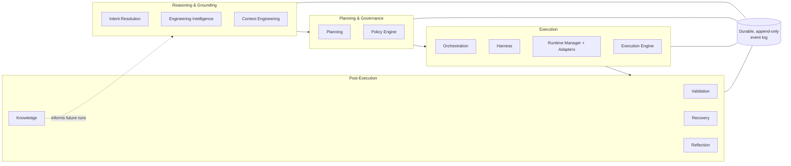

# Nexus

> **A governed, deterministic control plane for AI-driven execution.**

[](CHANGELOG.md)
[](docs/v2/V2_RELEASE_EXECUTION_REPORT.md)
[](https://python.org)
[](LICENSE)
[](https://github.com/STiFLeR7/nexus/actions/workflows/core-ci.yml)
[](https://github.com/astral-sh/ruff)
[](https://mypy-lang.org/)

---

## What is Nexus?

Nexus turns an operator's goal into governed, auditable, replayable execution. It resolves intent,
plans the work, selects and allocates a runtime, executes it, judges the outcome against evidence (not
the runtime's own claim of success), recovers from failure deterministically, and durably records what
was learned — with a policy engine that can deny any of it, fail-closed, at every step.

It is **not** a chatbot, an agent-wrapper, or a prompt library. Decisions about *what* runs, *when*, and
*whether it's allowed* are deterministic and rule-based; the LLM runtimes it drives are one interchangeable
component in a much larger governed pipeline, not the thing making the decisions.

> **Two systems live in this repository.** The platform described in this README is **Nexus v2**
> (`nexus_*`, 31 packages) — an independent, from-scratch rebuild released as `v2.0.0`. An earlier,
> separately-released system, **Nexus v1** (`nexus/`, `v1.0.0`/`v1.0.1`), also lives here — a
> Discord-fronted orchestration console. The two share no code, schema, or process in either direction.
> If you're looking for v1: [ONBOARDING.md](ONBOARDING.md). Not sure which you need? [docs/README.md](docs/README.md).

## Why Nexus Exists

Running an AI agent is easy. Trusting it in production is not — because "did this actually work" is a
harder question than "did the model return a plausible-looking response," and "can I explain why this
ran" is a harder question than "it ran." Nexus exists because those two questions need a real answer
before autonomy is safe to grant: every execution must be evidence-validated, every decision must have
exactly one accountable owner, and every state must be reconstructible from a durable, append-only log —
not trusted from memory.

## Core Capabilities

Nexus is organized as thirteen single-owner capabilities (Constitution: no two subsystems ever own the
same decision), grouped into four planes:

| Plane | Capabilities | What it owns |
|---|---|---|
| **Reasoning & Grounding** | Intent Resolution, Engineering Intelligence, Repository Intelligence, Execution History, Estimation, Context Engineering | Understanding *what* is being asked and the state of the world it's being asked in |
| **Planning & Governance** | Planning, Policy Engine, Orchestration, Harness | Deciding *what work* should happen, and whether it's *allowed* to |
| **Execution** | Runtime Manager, Runtime Adapters, Execution Engine | Actually running the work, against exactly one deterministically-allocated runtime |
| **Post-Execution** | Validation, Recovery, Reflection, Knowledge | Judging the outcome from evidence, recovering from failure, and durably remembering what happened |

Two more subsystems make it operable rather than just correct: the **Scheduler** (governed autonomy —
Manual / Governed / Fully-Automatic — and deterministic timing, never a wall clock inside the platform)
and the **Approval Exchange** (the human-in-the-loop gate execution pauses at and resumes from). See
[docs/architecture/README.md](docs/architecture/README.md) for the full portal into all thirteen.

## Architecture



Every plane reads from and writes to the same durable event log — nothing is a private datastore, and
every projection (a Goal, a Plan, an ExecutionState) is reconstructed from it, never mutated in place.
This is what makes replay and restart exact rather than best-effort.

## Example Execution Lifecycle

One request drives all nine constitutional stages, in this fixed order, through
`ConstitutionalPipeline.run(...)`:


`Actuation` is not a single step — it's Orchestration selecting what's executable, Harness compiling it
into a runtime-ready package, the Runtime Manager allocating exactly one runtime, and the Execution Engine
running it, bridged together as one stage of the pipeline. If a run is interrupted at any point, restarting
it replays the durable log and resumes from the last completed stage — it never re-runs work already done,
and (verified directly, `docs/v2/RC2_EXECUTION_IDENTITY_REPORT.md`) it never adopts another goal's state by
mistake, even when two goals share the same durable log concurrently.

## Why Nexus is Different

- **Deterministic, not best-effort.** Routing, scheduling, and governance decisions are rule-based. The
  same input, replayed against the same log, reconstructs the same state — every time.
- **Single-owner governance.** Every kind of decision (policy, planning, runtime selection, validation...)
  has exactly one subsystem that makes it. No two subsystems can silently disagree about who's in charge.
- **Fail-closed by default.** An action with no matching policy is denied, not allowed through.
- **Evidence-validated, not self-reported.** Whether an execution succeeded is judged from deterministic
  evidence the platform collects — never taken as the runtime's own word for it.
- **Replay and restart are load-bearing, not aspirational.** Measured, not assumed:
  replaying 20,000 events reconstructs state in ~216 ms; restarting from the same scale takes ~181 ms
  (`docs/v2/RC1_PRODUCTIZATION_REPORT.md` §6).
- **Governed autonomy, not unattended autonomy.** A goal can run Manual, Governed, or Fully-Automatic —
  the platform never grants more autonomy than the operator's policy allows.

## Installation

Requires Python 3.12+ and [`uv`](https://docs.astral.sh/uv/).

```bash
git clone https://github.com/STiFLeR7/nexus.git
cd nexus
uv sync
```

## Quick Start

```bash
# Boot the full constitutional platform over a durable SQLite log, run one scheduler tick, exit.
python -m nexus_scheduler --db nexus_v2.db --once --log-level INFO

# Or run it as a long-lived service (default: one tick every 5 seconds until interrupted):
python -m nexus_scheduler --db nexus_v2.db
```

Registering work is a caller concern via the same composition-root API the entrypoint itself uses
(`Scheduler.schedule_goal` / `schedule_operation`) — the entrypoint boots the platform, it doesn't author
Goals for you. See [docs/internals/WALKTHROUGH-v2.md](docs/internals/WALKTHROUGH-v2.md) for the full
composition-root pattern and a worked example of how one Goal's identity flows through every stage above.

## Documentation Map

| Start here | For |
|---|---|
| [docs/getting-started/README.md](docs/getting-started/README.md) | Brand new — clone to first successful run in under 15 minutes |
| [docs/README.md](docs/README.md) | Not sure where to go — routes v1 vs. v2, explains the whole doc tree |
| [docs/tutorials/README.md](docs/tutorials/README.md) | Learning by doing — ten guided tutorials, each pointing at a runnable example |
| [docs/internals/WALKTHROUGH-v2.md](docs/internals/WALKTHROUGH-v2.md) | Reading the v2 code for the first time |
| [docs/architecture/README.md](docs/architecture/README.md) | The full architecture portal — Constitution, ADRs, every subsystem |
| [docs/benchmarks/README.md](docs/benchmarks/README.md) | What's actually been measured, and what hasn't |
| [docs/v2/OPERATOR_GUIDE.md](docs/v2/OPERATOR_GUIDE.md) | Running and operating the platform |
| [docs/development/CONTRIBUTING.md](docs/development/CONTRIBUTING.md) | Contributing to v2 |
| [docs/releases/README.md](docs/releases/README.md) | How versioning, releases, and long-term maintenance actually work |

## Examples

Ten runnable examples in [`examples/`](examples/), each demonstrating one architectural capability
against real, released APIs — no pseudo-code, no invented functionality. Start with
[`examples/01-hello-nexus`](examples/01-hello-nexus/) (the smallest complete run) and
[`examples/10-autonomous-workflow`](examples/10-autonomous-workflow/) (the full showcase); see
[`examples/README.md`](examples/README.md) for the complete learning progression. Prefer a guided,
concept-by-concept path instead? [`docs/tutorials/README.md`](docs/tutorials/README.md) walks through the
same examples with explanation in between.

## Integrations

Three runtime adapters ship today, each implementing the same `RuntimeAdapter` protocol
(`nexus_execution.adapter`) so the platform never branches on provider identity above the adapter layer:

| Adapter | Package | Drives |
|---|---|---|
| Claude Code | `nexus_runtime_claude` | Anthropic's Claude Code CLI |
| Gemini CLI | `nexus_runtime_gemini` | Google's Gemini CLI |
| Shell | `nexus_runtime_shell` | A local shell process |

`nexus_runtime_adapters` is the generic registry/discovery layer a new provider plugs into — see
`docs/runtime/adapters/ADAPTER_REGISTRY.md`.

## Roadmap

No dedicated v2 roadmap document exists yet. The most current forward-looking source is
`CHANGELOG.md`'s `[2.0.0]` entry's own "Known Limitations" section (no v1→v2 data migration tool, an
unversioned durable schema, ADR-009 filed but unratified, two subsystems built but not yet wired to an
entrypoint). Nexus v1's roadmap is tracked separately in `blueprint/ROADMAP.md`.

## Contributing

v2: [docs/development/CONTRIBUTING.md](docs/development/CONTRIBUTING.md) (`make check` runs the same
lint/type/test gate as CI). v1: [CONTRIBUTING.md](CONTRIBUTING.md) (root).

## License

[MIT](LICENSE).
