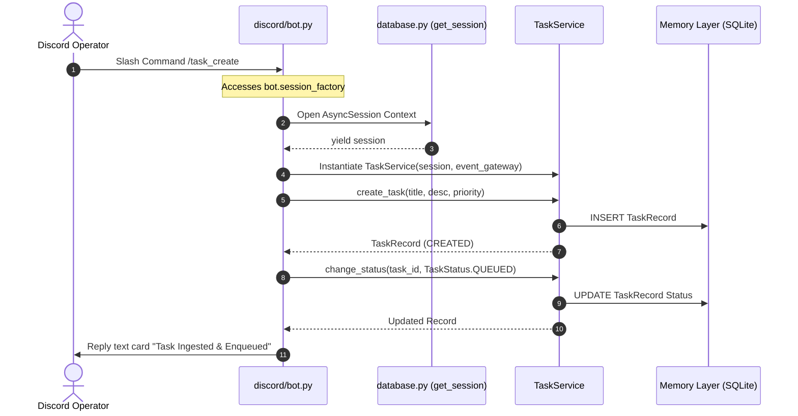
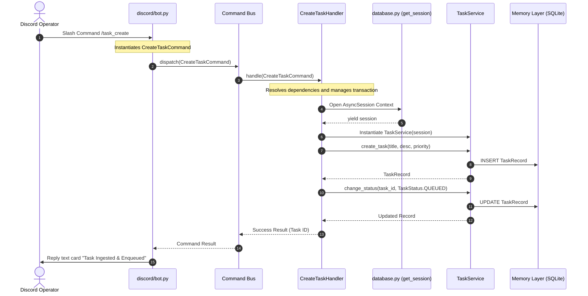

# Application Command Bus Design

This document details the architectural design for introducing a formal Application Command Bus to decouple communication adapters from core transactional logic inside the Nexus Control Plane.

---

## 1. Concept Overview

A **Command Bus** is a behavioral pattern that acts as a message router, decoupling the request originator (e.g., [bot.py](file:///D:/nexus/nexus/communication/discord/bot.py)) from the operational handler that executes business rules. 

Under the current implementation, UI slash commands directly coordinate database sessions and invoke transactional logic. The Command Bus introduces an application boundary layer:

```
+------------------------------------+
|       Communication Adapter        |  (e.g., Discord Slash Command)
+-----------------+------------------+
                  |
                  | Dispatches Command Object
                  v
+-----------------+------------------+
|           Command Bus              |  (In-Memory Router)
+-----------------+------------------+
                  |
                  | Resolves and Invokes
                  v
+-----------------+------------------+
|         Command Handler            |  (Executes transactional boundaries)
+------------------------------------+
```

---

## 2. Sequential Workflows

### Current Discord Flow
In the current flow, UI components directly access the persistence layer, which creates high coupling:



### Proposed Command Bus Flow
The proposed architecture isolates the communication layer, restricting it to command dispatching:



---

## 3. Analysis of Flows

### Coupling Points
* **Current Flow**: [bot.py](file:///D:/nexus/nexus/communication/discord/bot.py) is directly coupled to [database.py](file:///D:/nexus/nexus/database.py), [TaskService](file:///D:/nexus/nexus/memory/task_service.py), and [ApprovalService](file:///D:/nexus/nexus/approvals/service.py).
* **Proposed Flow**: [bot.py](file:///D:/nexus/nexus/communication/discord/bot.py) is only coupled to the Command Bus interface and the command data transfer objects (DTOs).

### Hidden Dependencies
* In the current flow, database session management (such as transaction commits and rollbacks) is handled directly inside slash commands. If a session throws an error, the Discord interaction itself can fail if not caught, bypassing domain exceptions.
* In the proposed flow, transactions are contained within Command Handlers, ensuring that failures are translated into structured command responses.

### Testing Implications
* **Current Flow**: Testing requires complex mocks of Discord interaction objects and connection factories.
* **Proposed Flow**: Commands and handlers are pure Python objects that can be unit-tested without mocking any Discord components or invoking connection state frameworks.

### Future Maintenance
* As email gateways and runner platforms are added, they can reuse commands (`CreateTaskCommand`, `ApproveTaskCommand`) without duplicating database connection logic.
