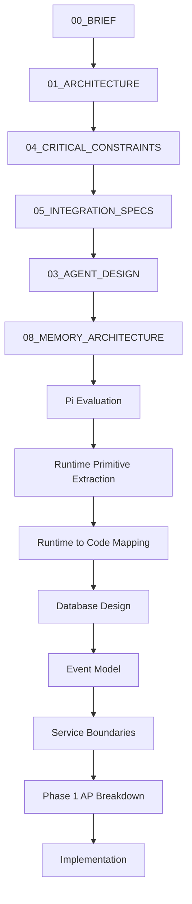

# Architectural Evolution of Nexus

This document outlines the systematic design process that led from the initial project brief to the concrete engineering action points for Phase 1. It serves as the official onboarding guide for future contributors to understand the architectural decisions and history of the Nexus codebase.

---

## Evolution Flowchart

---

## Narrative Walkthrough

### 1. The Strategic Phase (Brief, Architecture, and Constraints)

#### Stage A: Initial Foundational Brief (`00_BRIEF.md`)
- **Why it existed**: Hill Patel (Owner) required a persistent digital operations manager to bridge the operational gap between humans and AI code executors (such as Gemini CLI and Claude Code).
- **What problem it solved**: Avoided the classic trap of treating the project as a simple "chatbot" or wrapper. It established that **orchestration is the product, conversation is a interface**.
- **Maturity gained**: Scoped the minimum viable product (MVP), established the single-operator focus (Hill Patel as director), and identified Discord and Email as primary and secondary communication channels.
- **Implementation Inputs**: Mapped directly to initial Pydantic settings and package directory structure.

#### Stage B: Conceptual Architecture (`01_ARCHITECTURE.md`)
- **Why it existed**: To divide the operational control plane into logical, decoupled layers.
- **What problem it solved**: Prevented external communication channels (like Discord or Email) from leaking internal business/orchestration logic.
- **Maturity gained**: Defined the 6 architectural layers: Communication, Event Gateway, Nexus Core, Memory + Scheduling + Intelligence, Execution Layer, and Repository allowlist.
- **Implementation Inputs**: Dictated the creation of the `nexus/core/`, `nexus/gateway/`, `nexus/memory/`, `nexus/execution/`, and `nexus/agents/` package boundaries.

#### Stage C: Non-Negotiable Constraints (`05_CRITICAL_CONSTRAINTS.md`)
- **Why it existed**: To enforce strict boundaries of safety, recovery, state preservation, and human authority.
- **What problem it solved**: Blocked agent overreach (e.g. running destructive shell commands or bypassing human approvals).
- **Maturity gained**: Established the golden rule: **Humans own authority, Memory owns truth, Agents provide capability**. Mandated that no workflow state can disappear and no arbitrary shell executions are permitted.
- **Implementation Inputs**: Enforced strict allowlist validation configurations (`repositories.yaml`) and pre-execution authorization interceptors.

---

### 2. The Integration and Reasoning Design

#### Stage D: System Integration Specifications (`04_INTEGRATION_SPECS.md`)
- **Why it existed**: To formalize communication contracts with Discord, SMTP, and OpenRouter.
- **What problem it solved**: Shielded the control plane from external provider API updates or network drops.
- **Maturity gained**: Mandated async operations for Discord bot clients (`discord.py`) and SMTP mail loops (`aiosmtplib`), and defined OpenRouter model chains with fallback triggers.
- **Implementation Inputs**: Settings models in `nexus/config.py` and email routing logic configurations.

#### Stage E: Agent & Planner Design (`03_AGENT_DESIGN.md`)
- **Why it existed**: To structure how autonomous reasoning tasks operate without bypassing the deterministic orchestrator.
- **What problem it solved**: Stopped the LLM from mutating database records directly.
- **Maturity gained**: Standardized the loop: Planner generates execution steps -> Orchestrator requests human approval -> Subprocess Runner executes step -> Result is logged.
- **Implementation Inputs**: Mapped to the `nexus/agents/` package stub interfaces.

#### Stage F: Memory Architecture (`08_MEMORY_ARCHITECTURE.md`)
- **Why it existed**: To define the persistence layers for tasks, approvals, executions, audit logs, and knowledge fragments.
- **What problem it solved**: Ensured the system could recover its exact execution state after an unexpected process crash or system reboot.
- **Maturity gained**: Divided memory into transactional storage (SQLite/PostgreSQL) and event-based history tracking.
- **Implementation Inputs**: Outlined the primary tables (`tasks`, `approvals`, `executions`) and initial database model configurations.

---

### 3. The Meta-Evaluation Phase (Pi Core Analysis)

#### Stage G & H: Pi Core Evaluation & Primitive Extraction
- **Why it existed**: To analyze why the Pi Core developer agent harness feels significantly more reliable and disciplined than typical frameworks before building Nexus's orchestrator from scratch.
- **What problem it solved**: Prevented Nexus from building fragile in-memory session trees and forced the adoption of durable, append-only log replay designs.
- **Maturity gained**: Identified the distinction between **first-class durable primitives** (immutable records saved in SQLite) and **derived ephemeral primitives** (reconstructed in-memory states like the context window).
- **Implementation Inputs**: Foundational reports stored in `blueprint/reports/` and `blueprint/DECISIONS/ADR-012-pi-core-patterns.md`.

---

### 4. The Engineering and Execution Phase

#### Stage I: Runtime-to-Code Mapping (`runtime-to-code-mapping.md`)
- **Why it existed**: To translate the abstract runtime primitives into concrete Python types, persistence rows, service layers, and event types.
- **What problem it solved**: Bridged the gap between high-level architectural ideas and concrete engineering interfaces.
- **Maturity gained**: Established precise Python interfaces (`TaskService`, `ExecutionService`, `ContextCompiler`) and detailed the live state machines.
- **Implementation Inputs**: Enforced strict validation contracts.

#### Stage J, K, and L: Low-Level Schema, Event, and Boundary Designs
- **Why it existed**: To define database fields, event catalogs, and package dependency trees before implementation.
- **What problem it solved**: Prevented circular package dependencies, sql migration errors, and unstructured event payloads.
- **Maturity gained**: Mapped out 8 SQLite tables (WAL mode), 12 first-class event models (Pydantic schemas), and strict import boundaries (Layer 1 through Layer 6).
- **Implementation Inputs**: `models.py`, `schemas.py`, and `events.py` layout contracts.

#### Stage M: Phase 1 Action Point Breakdown (`phase-01-ap-breakdown.md`)
- **Why it existed**: To define an incremental, test-driven path to build Nexus Core.
- **What problem it solved**: Prevented vertical-slice implementation drift by mapping out 6 small, testable milestones.
- **Maturity gained**: Defined deliverables, test rules, and exit criteria for each phase.
- **Implementation Inputs**: The active work schedule for the builder.
