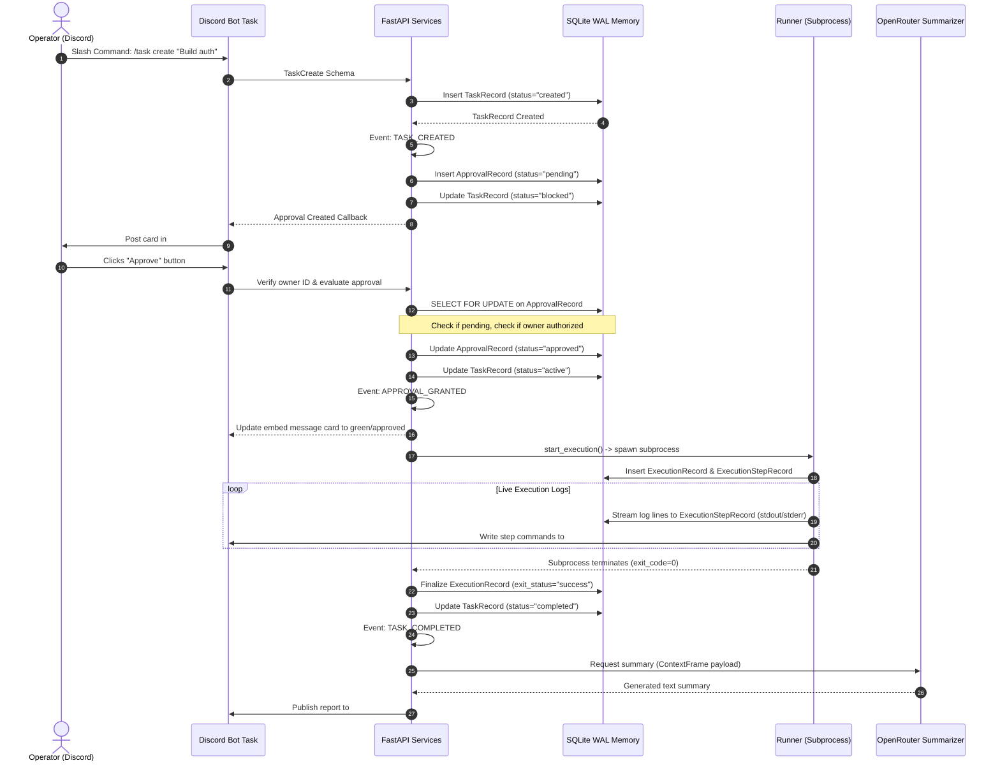

# End-to-End MVP User Workflow

This document charts the sequence of execution steps from initial task ingestion on Discord to complete run finalization and recovery.

---

## 1. Sequence Diagram

---

## 2. Timeline Step-by-Step

1. **Create Task**: Operator runs `/task create` inside Discord.
2. **Observe Task Persistence**: Task is persisted in SQLite database as `created`, then queued.
3. **Receive Approval Request**: Interactive card is posted to `#approvals` containing button widgets.
4. **Approve via Owner**: Designated owner clicks **Approve** button, validating user authorization.
5. **Trigger Execution**: Nexus engine transitions the task to `active` and spawns the configured command step.
6. **Record Execution Results**: Raw stdout/stderr terminal blocks are saved into the database execution step records.
7. **Generate Summary**: OpenRouter model parses the task and execution logs, writing a summary to `#summaries`.
8. **Verify Restart Recovery**:
   * If the Nexus process crashes during Step 5, upon reboot the startup lifecycle manager scans for running execution records.
   * Stale execution records are updated to `failed`/`timed_out`, and the parent task is cleanly rolled back to `FAILED` or re-queued, eliminating orphaned background tasks.
