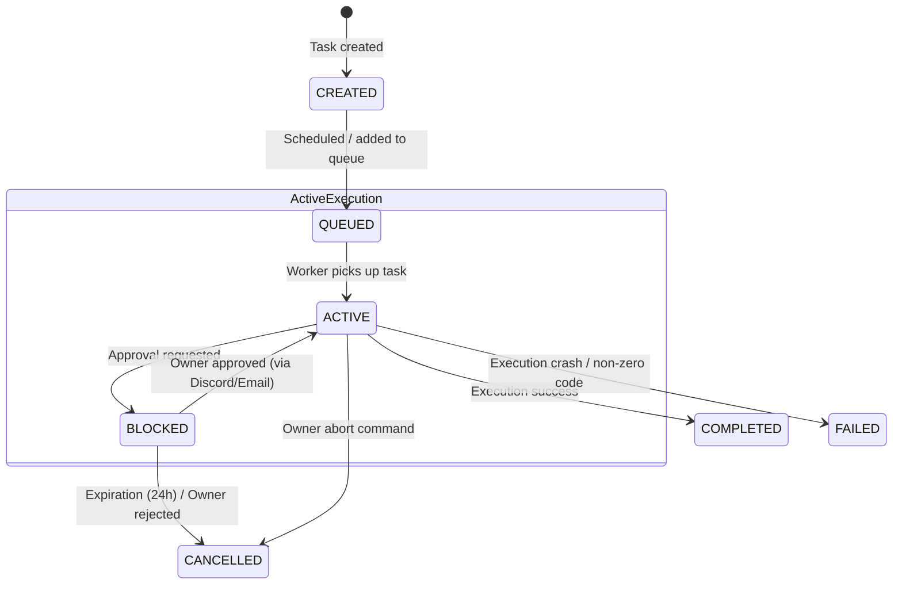
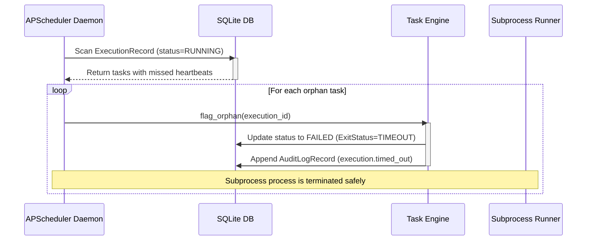

# Nexus Runtime Model Specification

This document defines the operational execution models, state machines, and event lifecycles of the **Nexus Control Plane Runtime**.

---

## 1. Runtime State Machine

Nexus tasks progress through a strongly typed state machine managed by the Task Engine. Every transition is validated and recorded to the audit ledger.



### Transition Guards
- **CREATED → QUEUED**: Verify task data is complete and the target repository is registered in `repositories.yaml`.
- **QUEUED → ACTIVE**: Ensure execution slot is available and locks are acquired.
- **ACTIVE → BLOCKED**: Triggered if the execution step is classified as privileged (requires approval).
- **BLOCKED → ACTIVE**: Allowed only when an `ApprovalRecord` is transitioned to `approved` via owner Discord ID verification.
- **BLOCKED → CANCELLED**: Triggered on explicit owner rejection or when the 24-hour expiration threshold is crossed.

---

## 2. Event Model

All state changes generate standard Pydantic `NexusEvent` schemas routed through the Event Gateway.

### Core Runtime Event Flow

```
[System Event Generated] 
           |
           v
   (Event Gateway) 
     |          |
     |          +-----> [Audit Ledger] (Append AuditLogRecord)
     v
(Subsystem Router)
     |
     +-----> Communication Subsystem (Discord Card Embed)
     +-----> Task Engine (Lifecycle State Shift)
     +-----> Execution Subsystem (Start Subprocess Runner)
```

- **Correlation ID Preservation**: Every task execution inherits a single `correlation_id` (UUID). This ID must be propagated through all generated events, database audit records, and runner logs to enable request tracing.

---

## 3. Checkpoint & Recovery Model

To prevent execution failures from blocking the control plane, Nexus runs an automated heartbeat monitor.



### Heartbeat and Crash Boundaries
- **Heartbeat Daemon**: An APScheduler job runs every 60 seconds to inspect active `ExecutionRecord` entries.
- **Orphan Verification**: If `last_heartbeat` is older than `timeout_threshold` (configured per runner in `settings.yaml`), the step is classified as failed.
- **Recovery Resolution**: The task state is set to `FAILED`. A rollback transition is committed, and notifications are sent.

---

## 4. Context Compilation Model

Context compilation ensures the LLM receives clean, focused historical parameters.

```
       [Compile LLM Request]
                 |
        (Get Task History)
                 |
      (Check for Checkpoints)
        /                 \
   [Checkpoint]      [No Checkpoint]
       /                     \
(Load state summary)    (Load full event logs)
       \                     /
        (Prune older logs)
                 |
       (Translate payload)
                 |
                 v
       [Send to OpenRouter]
```

- **Truncation Boundary**: When context reaches 75% capacity, the compiler triggers an OpenRouter summarization, records a new `WorkflowCheckpointRecord`, and prunes all logs prior to that checkpoint.
- **Payload Translation**: decoupled internal schema representations (`TaskRecord`, `ExecutionRecord`) are mapped to the standard LLM messages list right at the OpenRouter client border.
