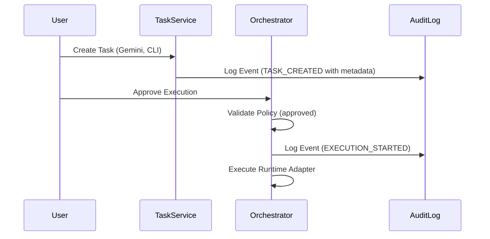

# Runtime Governance Design

This document details the **Runtime Governance Framework** in Nexus. It establishes the rules, check gates, and auditing procedures that prevent unauthorized execution and verify compliance across CLI and Agent runtimes.

---

## 1. Governance Architecture

Governance rules intercept tasks at multiple levels:
1. **Task Ingestion**: Verifies that the requested `runtime_type` and `runtime_id` exist.
2. **Approval Phase**: Tasks matching specific runtime profiles or ids might require high-privilege human operator approval.
3. **Execution Gate**: The orchestrator checks the `runtime_policy` status. If a task's policy is `"blocked"`, it is immediately aborted.
4. **Adapter Validation**: CLI adapters run commands through repository blocklists/allowlists before spawning processes.

---

## 2. Policy Definitions

| Policy | Level | Enforcement Action |
| --- | --- | --- |
| **Approved** | Unrestricted | The task is eligible to run immediately once approval is granted. |
| **Monitored** | Warning | Task executes with higher telemetry resolution, logging every sub-step and command. |
| **Blocked** | Denied | The task cannot run. If queued, it immediately transitions to a `FAILED` or `CANCELLED` status. |

---

## 3. Auditable Verification Trace

Every step of governance is captured in the database to establish an auditable trace:

1. **System Events**: Recorded in [AuditLogRecord](file:///D:/nexus/nexus/memory/models.py):
   * `TASK_CREATED`: Logs initial runtime selection parameters.
   * `APPROVAL_GRANTED`: Captures the operator ID who authorized the execution.
   * `EXECUTION_STARTED`: Records the active profile constraints.
2. **Repository Governance**: Matches instructions against [RepositoryRegistryRecord](file:///D:/nexus/nexus/memory/models.py) configurations to prevent unauthorized paths or branch actions.

This multi-layered approach guarantees that runtime operations remain explicitly auditable, governed, and compliant.
