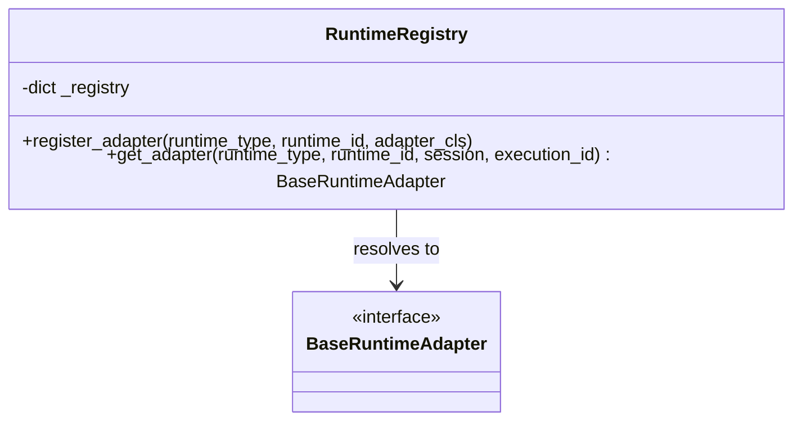

# Runtime Registry Design

This document details the architecture of the **Runtime Registry** in Nexus. The registry is designed to decouple task orchestration from concrete runtime implementations, enabling new execution adapters to be plugged in without requiring code changes in orchestrator routing.

---

## 1. Registry Architecture

The registry acts as a central lookup authority. It matches the `(runtime_type, runtime_id)` requested by a task to its corresponding implementation class.



### Registration Mechanics

When a new runtime adapter is defined, it registers itself with the registry. This can be done via a class decorator or explicit setup:

```python
class RuntimeRegistry:
    def __init__(self) -> None:
        self._registry: dict[tuple[str, str], type[BaseRuntimeAdapter]] = {}

    def register(self, runtime_type: str, runtime_id: str):
        def decorator(cls: type[BaseRuntimeAdapter]):
            self._registry[(runtime_type, runtime_id)] = cls
            return cls
        return decorator

    def get_adapter(
        self, runtime_type: str, runtime_id: str, session, execution_id
    ) -> BaseRuntimeAdapter:
        cls = self._registry.get((runtime_type, runtime_id))
        if not cls:
            raise KeyError(f"No runtime registered for {runtime_type}/{runtime_id}")
        return cls(session, execution_id)

# Global registry instance
runtime_registry = RuntimeRegistry()
```

---

## 2. Dynamic Registration of Current Runtimes

The current adapters are registered into the framework as follows:

```python
@runtime_registry.register(runtime_type="cli", runtime_id="gemini")
class GeminiRuntimeAdapter(CLIRuntimeAdapter):
    pass

@runtime_registry.register(runtime_type="agent", runtime_id="hermes")
class HermesRuntimeAdapter(AgentRuntimeAdapter):
    pass
```

### Future Extensibility (e.g., Claude Code)

Integrating future runtimes like Claude Code does not alter the orchestrator:

```python
# Added in a new module: execution/runners/claude.py
@runtime_registry.register(runtime_type="cli", runtime_id="claude")
class ClaudeRuntimeAdapter(CLIRuntimeAdapter):
    pass
```
The orchestrator simply queries the registry using `runtime_type="cli"` and `runtime_id="claude"`. The new runtime becomes immediately available.
