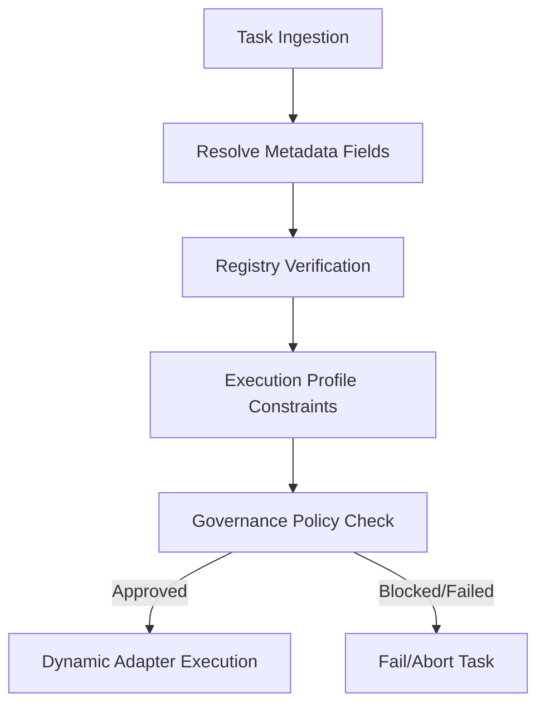

# Runtime Selection Architecture Design

This document details the design of the **Runtime Selection Mechanism** in Nexus. It establishes a structured flow for mapping incoming tasks to explicit, governed execution runtimes.

---

## 1. Routing Flow Overview

The diagram below outlines the transition from task creation to runtime execution:



Under this model:
1. Every task is created with explicit runtime metadata: `runtime_type`, `runtime_id`, `execution_profile`, and `runtime_policy`.
2. The [WorkflowOrchestrator](file:///D:/nexus/nexus/scheduling/orchestrator.py) fetches these fields directly.
3. The orchestrator checks the **Runtime Registry** to retrieve the correct adapter instance based on `runtime_id` and `runtime_type`.
4. The execution parameters (such as timeouts) are resolved from the **Execution Profile**.
5. The **Runtime Policy** controls whether the task is authorized to run.

---

## 2. Metadata Columns

The database schema `TaskRecord` inside [models.py](file:///D:/nexus/nexus/memory/models.py) explicitly supports:

| Column | Type | Description | Default |
| --- | --- | --- | --- |
| `runtime_type` | `String(50)` | The runtime classification: `cli`, `agent`, `research` | `"cli"` |
| `runtime_id` | `String(50)` | The specific runner instance: `gemini`, `nexus`, `claude` | `"gemini"` |
| `execution_profile` | `String(50)` | Context configurations: `research`, `coding`, `analysis` | `"default"` |
| `runtime_policy` | `String(100)`| Policy status: `approved`, `monitored`, `blocked` | `"approved"` |

---

## 3. Dynamic Selection Logic

The orchestrator resolves the runner dynamically rather than executing string matching checks:

```python
# Resolved fields from TaskRecord
runtime_type = task.runtime_type
runtime_id = task.runtime_id
profile = task.execution_profile
policy = task.runtime_policy

# Enforce governance
if policy == "blocked":
    raise UnauthorizedActionError(f"Task execution blocked by policy: {policy}")

# Resolve runner from Registry
adapter = runtime_registry.get_adapter(
    runtime_type=runtime_type,
    runtime_id=runtime_id,
    session=session,
    execution_id=execution_id
)
```
This guarantees complete separation of routing logic and runtime capabilities.
