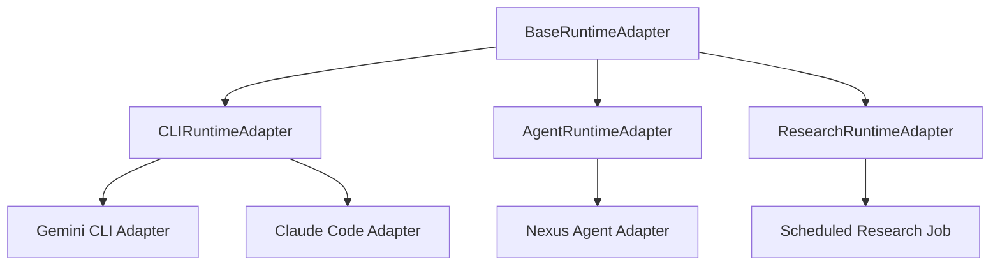

# Nexus Runtime Taxonomy

This document establishes the official taxonomy of AI execution runtimes within the Nexus control plane. It defines runtime categories, execution expectations, output captures, and governance scopes.

---

## 1. Runtime Taxonomy Hierarchy

---

## 2. Taxonomy Definitions

### A. CLI Runtime (Subprocess CLI)
* **Definition**: A runtime that spawns local binaries, utilities, or command-line wrappers inside an OS subprocess shell.
* **Examples**: Gemini CLI, Claude Code.
* **Execution Parameters**: Takes a concrete command string (e.g. `python script.py`, `npm run dev`) and executes in a local working directory.
* **Output Capture**: Captures traditional `stdout` and `stderr` streams, exit codes, and standard git diffs.
* **Governance Model**: Pre-run path containment, command blacklist checks, and branch whitelisting.

### B. Agent Runtime (API-Driven Agent)
* **Definition**: A runtime that maintains an autonomous reasoning loop, calling LLMs and executing tool integrations over APIs.
* **Examples**: Nexus Agent.
* **Execution Parameters**: Takes a high-level system goal or user prompt. Operates in an iterative loop (Thought -> Action -> Observation).
* **Output Capture**: Captures tool call payloads, model completion logs, planning states, and filesystem modifications.
* **Governance Model**: Inline runtime guardrails checking tool arguments *during* the execution loop.

### C. Research Runtime (Background Worker)
* **Definition**: A background process scheduled to query external search engines, fetch articles, and persist knowledge fragments without operator intervention.
* **Examples**: News swept jobs, model releases tracking.
* **Execution Parameters**: Takes search queries or URL targets, executing on a recurring cron schedule.
* **Output Capture**: Distilled knowledge records, markdown summaries, and database entity writes.
* **Governance Model**: Rate limiting and domain whitelisting.
