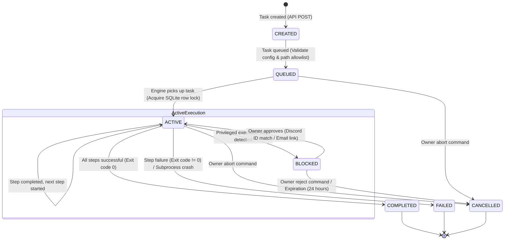
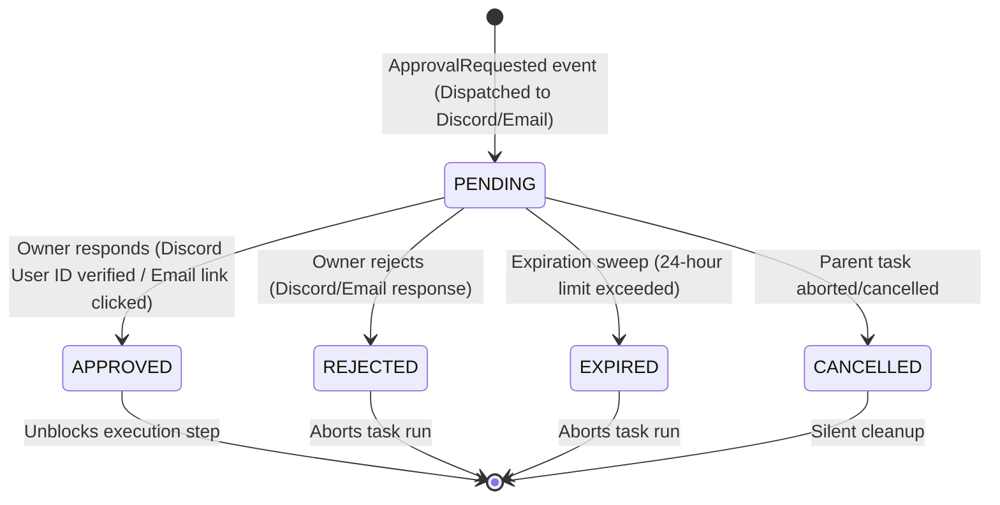
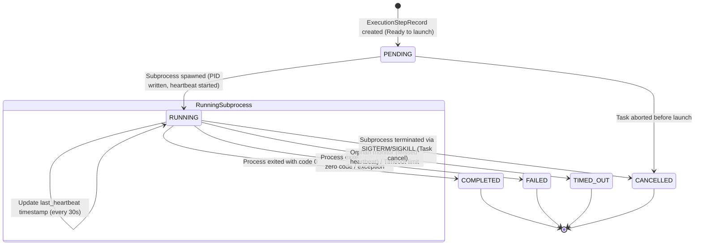
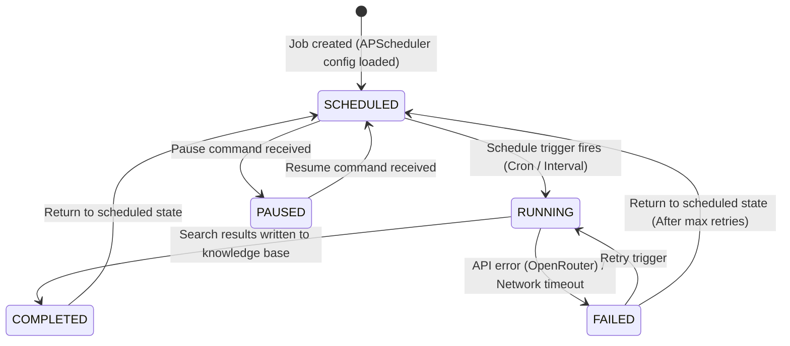
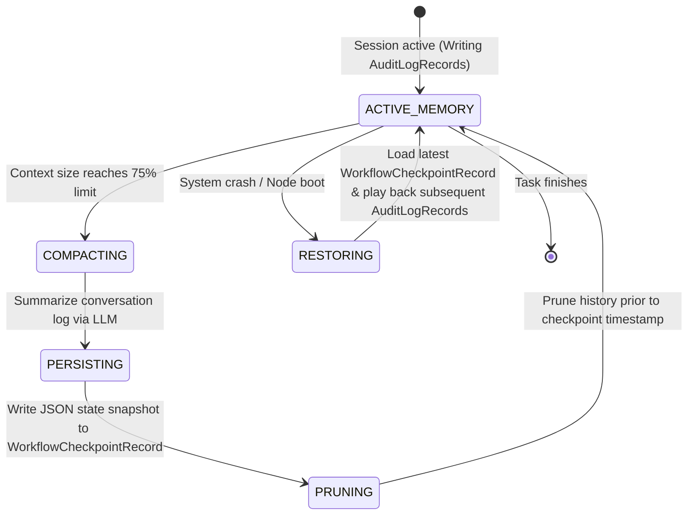

# Nexus Runtime-to-Code Mapping Spec

This document establishes the concrete mapping between the abstract **Nexus Runtime Primitives** and the Python type systems, database columns, service actions, and event pipelines.

---

## Primitive Mapping Matrix

| Runtime Primitive | Python Type | Persistence Layer | Service Layer | Event Layer |
|---|---|---|---|---|
| **Task** | `TaskRecord` (SQLAlchemy), `TaskStatus` (Enum), `TaskCreate`/`TaskResponse` (Pydantic) | `tasks` database table (SQLite) | `TaskService` (CRUD, status transition, locking) | Produces `TaskCreated`, `TaskQueued`, `TaskCompleted`, `TaskCancelled`, `TaskFailed` events. |
| **ExecutionStep** | `ExecutionStepRecord` (SQLAlchemy), `ExecutionStatus` (Enum) | `execution_steps` table. Foreign key to `executions.id`. | `ExecutionService` (Spawns runner, polls heartbeats, terminates process) | Produces `ExecutionStepStarted`, `ExecutionStepHeartbeat`, `ExecutionStepCompleted`, `ExecutionStepFailed` events. |
| **ExecutionResult** | `ExecutionRecord` payload columns (`logs` text, `result` JSON) | `executions` table columns | `ExecutionService` (Appends subprocess output, parses exit status) | Triggers `ExecutionCompleted` or `ExecutionFailed` events. |
| **StateTransition**| `AuditLogRecord` (SQLAlchemy), `EventType` (Enum) | `audit_logs` table (immutable, append-only) | `MemoryService` / `AuditService` (Appends ledger entries) | Captured by Event Gateway; generates audit trace logs. |
| **Checkpoint** | `WorkflowCheckpointRecord` (SQLAlchemy), `CheckpointState` (Pydantic) | `workflow_checkpoints` table | `MemoryService` (Saves JSON states, prunes prompts, loads snapshots) | Produces `CheckpointCreated` events. |
| **ContextFrame** | `ContextFrame` (Pydantic / ephemeral class) | None (assembled dynamically on request) | `ContextCompiler` (Traverses DB log paths, truncates, prunes) | Triggers no public events (internal compiler step). |
| **ApprovalStatus**| `ApprovalRecord` (SQLAlchemy), `ApprovalStatus` (Enum) | `approvals` table | `ApprovalService` (Creates approval gates, verifies Discord ID) | Produces `ApprovalRequested`, `ApprovalGranted`, `ApprovalRejected`, `ApprovalExpired` events. |
| **ActiveToolset**| `ActiveToolset` (Pydantic / configuration object) | `config/settings.yaml` & `config/repositories.yaml` | `ConfigurationService` / `TaskService` (Verifies registers, validates path) | Produces `SystemConfigLoaded` event on system boot. |

---

## Primitive Architectural Implementation Contracts

### 1. Task Primitive (`TaskRecord`)
- **Behavior**: Represents the state machine transaction boundary. All state alterations must acquire a row lock on the task row inside SQLite to avoid concurrent write races.
- **Contract**:
  ```python
  class TaskService:
      async def create_task(self, data: TaskCreate) -> TaskResponse: ...
      async def get_task(self, task_id: UUID) -> TaskResponse: ...
      async def update_task(self, task_id: UUID, data: TaskUpdate) -> TaskResponse: ...
      async def change_status(self, task_id: UUID, new_status: TaskStatus, actor: str) -> TaskResponse:
          # 1. Acquire transaction lock (SELECT FOR UPDATE equivalent in SQLite)
          # 2. Assert transition validity (validate against Task State Machine guards)
          # 3. Commit state column
          # 4. Insert AuditLogRecord (StateTransition primitive)
          # 5. Dispatch Event via EventGateway (e.g. TaskQueued / TaskStarted)
  ```

### 2. ExecutionStep Primitive (`ExecutionStepRecord`)
- **Behavior**: Represents an atomic tool call subprocess invocation. It must maintain a live heartbeat and handle standard streams asynchronously.
- **Contract**:
  ```python
  class ExecutionService:
      async def start_execution(self, task_id: UUID, runner: RunnerType) -> ExecutionResponse: ...
      async def run_step(self, step_id: UUID, command: str, timeout: int) -> ExecutionStepResult:
          # 1. Verify approval status is APPROVED if command is privileged
          # 2. Launch subprocess via asyncio.create_subprocess_shell
          # 3. Write PID to ExecutionStepRecord, set status = RUNNING
          # 4. Periodically update last_heartbeat timestamp
          # 5. Read stdout/stderr incrementally and write to execution logs
          # 6. Reap subprocess, finalize exit_code, status, and generate Event
  ```

### 3. ExecutionResult Primitive (`ExecutionRecord` data)
- **Behavior**: Aggregates the final output metadata, logs, and artifacts of a task run execution.
- **Contract**:
  ```python
  class ExecutionResultCollector:
      async def finalize_execution(self, execution_id: UUID, exit_status: ExitStatus, result_payload: dict) -> None:
          # 1. Gather all logs from execution_steps
          # 2. Write concatenated log buffer to ExecutionRecord
          # 3. Write JSON results payload
          # 4. Dispatch ExecutionCompleted or ExecutionFailed event
  ```

### 4. StateTransition Primitive (`AuditLogRecord`)
- **Behavior**: Immutable system log ledger tracking all state shifts across all domains.
- **Contract**:
  ```python
  class AuditService:
      async def record_transition(
          self, 
          event_type: EventType, 
          entity_type: str, 
          entity_id: UUID, 
          data: dict, 
          correlation_id: UUID, 
          actor: str
      ) -> None:
          # Write append-only AuditLogRecord. No update or delete operations allowed.
  ```

### 5. Checkpoint Primitive (`WorkflowCheckpointRecord`)
- **Behavior**: Stores serialized workflow state snapshots for resilience.
- **Contract**:
  ```python
  class MemoryService:
      async def create_checkpoint(self, workflow_id: UUID, step_name: str, state: dict) -> UUID:
          # Write WorkflowCheckpointRecord
      async def restore_checkpoint(self, workflow_id: UUID) -> dict:
          # Fetch latest WorkflowCheckpointRecord by completed_at timestamp
  ```

### 6. ContextFrame Primitive (`ContextFrame` Pydantic model)
- **Behavior**: Derived in-memory window of prompt content supplied to the LLM during turn execution.
- **Contract**:
  ```python
  class ContextCompiler:
      async def compile_context(self, task_id: UUID, max_tokens: int) -> ContextFrame:
          # 1. Load latest WorkflowCheckpointRecord for the task
          # 2. Query all AuditLogRecords generated AFTER the checkpoint's timestamp
          # 3. Merge checkpoint state with subsequent audit logs to build turn prompt
          # 4. If prompt size > 75% of max_tokens, trigger compaction/summarization
  ```

### 7. ApprovalStatus Primitive (`ApprovalRecord`)
- **Behavior**: Enforces manual verification gates on privileged actions.
- **Contract**:
  ```python
  class ApprovalService:
      async def request_approval(self, task_id: UUID, requester: str) -> ApprovalResponse: ...
      async def grant_approval(self, approval_id: UUID, decider_by: str, reason: str) -> ApprovalResponse: ...
      async def reject_approval(self, approval_id: UUID, decider_by: str, reason: str) -> ApprovalResponse: ...
      async def check_approval_status(self, task_id: UUID) -> ApprovalStatus:
          # Query approvals table for PENDING or APPROVED records
  ```

### 8. ActiveToolset Primitive (`ActiveToolset` config mapping)
- **Behavior**: Ephemeral mapping resolving which tools and paths are registered for the task.
- **Contract**:
  ```python
  class ToolsetRegistry:
      def resolve_toolset(self, repository_path: str) -> ActiveToolset:
          # Verify repository path matches allowlist config/repositories.yaml
          # Return permitted runners, environment variables, and directories
  ```

---

## Task 4: Runtime State Machines

Below are implementation-grade state machines and lifecycle visualizations representing the runtime behavior of the Nexus Control Plane.

### 1. Task State Machine

The Task State Machine governs the root workflow lifecycle. It ensures strict validation gates, transactional safety under row locks, and immutable audits.



### 2. Approval State Machine

Enforces human-in-the-loop authorization boundaries. Approvals default to a 24-hour expiration, tracked by a background scheduler sweep.



### 3. Execution State Machine

Governs the lifecycle of an individual subprocess runner execution step. Heartbeats are updated periodically to detect orphan processes.



### 4. Research State Machine

Tracks automated, periodic background research and information compilation jobs.



### 5. Checkpoint Lifecycle

Manages memory compaction and session state durability. When the compiled ContextFrame approaches the LLM context window limit, it is compacted into a checkpoint to preserve token availability.



