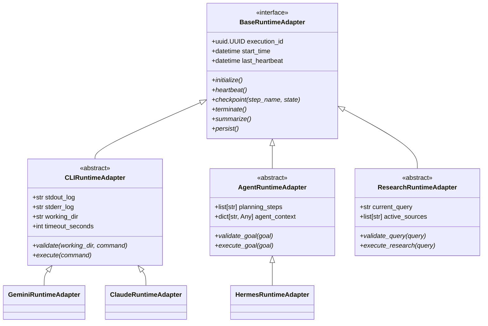

# Runtime V2 Architecture Design

This document details the architecture design for **Runtime V2** in Nexus. It outlines the class hierarchy, service orchestration, and interface separation designed to accommodate CLI, Agent, and Research workloads without structural leakage.

---

## 1. Class Hierarchy



---

## 2. Refactored Interfaces

### A. Base Runtime Interface
[BaseRuntimeAdapter](file:///D:/nexus/nexus/execution/runners/base.py) defines the lifecycle shared by all executors. It does not dictate inputs (such as command strings) or outputs (such as stdout streams).

```python
class BaseRuntimeAdapter(ABC):
    def __init__(self, db_session: AsyncSession, execution_id: uuid.UUID) -> None:
        self.session = db_session
        self.execution_id = execution_id
        self.start_time = datetime.now(UTC)

    @abstractmethod
    async def initialize(self) -> None:
        """Connect to APIs, check binaries, or verify API keys."""
        pass

    @abstractmethod
    async def heartbeat(self) -> None:
        """Update last_heartbeat timestamp to prevent scheduler timeout."""
        pass

    @abstractmethod
    async def checkpoint(self, step_name: str, state: dict[str, Any]) -> None:
        """Persist structured runner state checkpoints to SQLite."""
        pass

    @abstractmethod
    async def terminate(self) -> None:
        """Cancel network loops, kill processes, or signal active threads."""
        pass

    @abstractmethod
    async def summarize(self) -> str:
        """Compile execution traces into a clean markdown synthesis."""
        pass

    @abstractmethod
    async def persist(self) -> None:
        """Persist outputs, logs, diffs, or gathered facts as first-class artifacts."""
        pass
```

### B. CLI Runtime Interface
Wraps direct command execution inside local subprocess shells.
```python
class CLIRuntimeAdapter(BaseRuntimeAdapter, ABC):
    stdout_log: str
    stderr_log: str

    @abstractmethod
    async def validate(self, repository_path: str, command: str) -> None:
        """Run path containment, branch validation, and string blacklist filtering."""
        pass

    @abstractmethod
    async def execute(self, command: str) -> dict[str, Any]:
        """Spawn subprocess shell, stream streams, and return run metrics."""
        pass
```

### C. Agent Runtime Interface
Drives multi-step reasoning and tool execution cycles.
```python
class AgentRuntimeAdapter(BaseRuntimeAdapter, ABC):
    @abstractmethod
    async def validate_goal(self, goal: str) -> None:
        """Verify the user goal doesn't violate safety policies."""
        pass

    @abstractmethod
    async def execute_goal(self, goal: str) -> dict[str, Any]:
        """Run the reasoning, planning, and action loop."""
        pass
```

---

## 3. Orchestration Dispatching

Under V2, the [WorkflowOrchestrator](file:///D:/nexus/nexus/scheduling/orchestrator.py) dynamically inspects the task record to resolve the runtime group and selects the appropriate runner path:

```python
# Inside WorkflowOrchestrator.run_execution_flow:
adapter = get_runtime_adapter(runner_name, session, execution_id)

if isinstance(adapter, CLIRuntimeAdapter):
    await adapter.initialize()
    await adapter.validate(repository_path, command)
    result = await adapter.execute(command)
elif isinstance(adapter, AgentRuntimeAdapter):
    await adapter.initialize()
    await adapter.validate_goal(goal_or_prompt)
    result = await adapter.execute_goal(goal_or_prompt)
```
This isolates subprocess parameters (like raw shell commands) directly within the CLI execution path.
