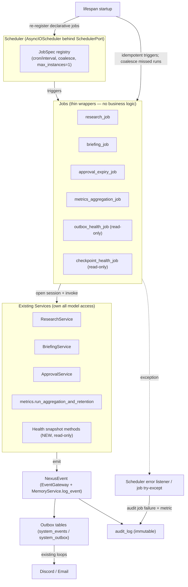

# Scheduler Foundation — Design (AP-103)

> **Release:** Nexus v1.0.1 "Alignment" · **AP:** AP-103 (design only) · **Finding:** A-003
> **Status:** PROPOSED — pending AP-103A approval. **No code/migrations/wiring in this AP.**
> Grounded in confirmed source interfaces (signatures verified at commit `aa3e527`).

---

## 1. Problem & objective

The Research, Briefing, Approval-expiration, and Metrics-aggregation capabilities **already exist**
as service methods but are **never triggered autonomously** (AP-101 §A-003). There is no scheduler
in `nexus/` despite `apscheduler` being installed. The objective is the **minimum scheduler
architecture** required to *operationalize already-existing capabilities* — not to add product
features.

## 2. Design principles (maps to the 10 AP-103 constraints)

| # | Constraint | Design response |
|---|---|---|
| 1 | No service-boundary violations | Scheduler lives in `nexus/scheduling/` (top layer per ADR-014); imports services, never lower internals out of order |
| 2 | No direct DB model access | Jobs never import `nexus.memory.models`; they open a session and hand it to a **service**, which owns model access |
| 3 | Interact through existing services | Jobs call `ResearchService` / `BriefingService` / `ApprovalService` / metrics functions only |
| 4 | Replaceable | A `SchedulerPort` Protocol abstracts the engine; `APSchedulerAdapter` is one implementation |
| 5 | APScheduler preferred | `AsyncIOScheduler` (asyncio-native, matches the existing loop model) |
| 6 | Future distributed scheduling | Port abstraction + optional persistent/clustered jobstore; jobs are stateless & idempotent |
| 7 | No business logic in jobs | Jobs are thin wrappers: open session → call service → audit on failure |
| 8 | Jobs invoke services only | Enforced by the job contract (§5) |
| 9 | Failures auditable | Per-job try/except + scheduler-level error listener → `MemoryService.log_event` (see `scheduler-failure-model.md`) |
| 10 | Restart-safe | Declarative re-registration at boot + idempotent jobs (see `scheduler-recovery-model.md`) |

## 3. Component architecture

```
nexus/scheduling/
├── orchestrator.py        (existing — event-driven WorkflowOrchestrator, UNCHANGED)
├── scheduler.py           (NEW @ AP-103B — SchedulerPort + APSchedulerAdapter)
└── jobs/                  (NEW @ AP-103B — thin job wrappers, one per capability)
    ├── research_job.py
    ├── briefing_job.py
    ├── approval_expiry_job.py
    ├── metrics_aggregation_job.py
    ├── outbox_health_job.py
    └── checkpoint_health_job.py
```

- **`SchedulerPort` (Protocol)** — `start()`, `shutdown()`, `add_job(job_spec)`. Keeps the engine
  replaceable (constraint 4/6).
- **`APSchedulerAdapter`** — wraps `AsyncIOScheduler`; registers an `EVENT_JOB_ERROR` /
  `EVENT_JOB_MISSED` listener that audits failures (constraint 9).
- **`JobSpec`** — `{ id, trigger (cron/interval), callable, coalesce=True, max_instances=1,
  misfire_grace_time }`.
- **Job wrappers** — signature `async def run_<x>_job(session_factory, deps) -> None`. Each: open
  `get_session(session_factory)`, construct the relevant service, call its method, and on exception
  emit an audit event + metric (no business logic of its own).
- **Lifespan integration** — the scheduler is started in `nexus/api.py` `lifespan` alongside the
  existing background loops, and shut down in the shutdown phase. (Wiring is AP-103B.)

## 4. The job contract (constraint 7/8 enforcement)

Every job body conforms to exactly this shape (illustrative, AP-103B):

```
async def run_<x>_job(session_factory, ...deps) -> None:
    async with get_session(session_factory) as session:        # session mgmt only
        service = <ExistingService>(session, ...deps)           # construct existing service
        await service.<existing_method>(...)                    # invoke service only
    # failures are caught by the scheduler wrapper -> audit + metric (failure-model.md)
```

No queries, no model imports, no orchestration logic in the job. Metrics aggregation is the one
functional (module-level) service: the job calls `run_aggregation_and_retention(session)`.

## 5. Candidate job analysis

> Frequencies below are **proposed defaults**, to be made configurable (a `scheduling` config
> section, additive, at AP-103B). All "Audit Requirements" use `MemoryService.log_event` with
> `component="scheduler"`.

### J1 — Research Collection
| Field | Value |
|---|---|
| Purpose | Crawl configured feeds → dedup → summarize → persist findings |
| Service | `ResearchService(session, openrouter_client, memory_service).execute_research_run(feeds)` |
| Trigger | interval/cron |
| Frequency | every 6h (proposed, configurable) |
| Inputs | `feeds: dict[str,str]` — ⚠ **no config source exists today** (see §6 dependency) |
| Outputs | `ResearchFindingRecord` rows; `RESEARCH_STARTED/COMPLETED/FAILED` events |
| Failure modes | feed fetch error (already swallowed per-feed); LLM failure (per-finding fallback); DB locked |
| Recovery | per-finding checkpoints; `resume_research_run`; URL/title dedup makes re-run idempotent |
| Audit | job start/finish + failure via scheduler wrapper; engine already audits `RESEARCH_*` |
| Operational value | Autonomous monitoring — the headline A-003 capability |
| **Classification** | **Existing Capability** (method exists); feeds input is a **Derived** dependency |

### J2 — Daily Briefings
| Field | Value |
|---|---|
| Purpose | Aggregate 24h operational state → render → deliver via outbox |
| Service | `BriefingService(session, memory_service, discord_service, email_service).generate_and_dispatch_briefing()` |
| Trigger | cron (time-of-day) |
| Frequency | daily @ configured hour (proposed 08:00 local) |
| Inputs | none (self-sources 24h data); `channels` default `[memory,discord,email]` |
| Outputs | `BriefingRecord`; `system_outbox` rows; `REPORT_GENERATED` event |
| Failure modes | aggregation error; delivery failure (handled by comm-outbox retry) |
| Recovery | content-hash dedup prevents duplicate briefings; `resume_briefing_run`; outbox retries delivery |
| Audit | job lifecycle via wrapper; engine audits `REPORT_GENERATED` / `NOTIFICATION_*` |
| Operational value | Daily operator awareness |
| **Classification** | **Existing Capability** |

### J3 — Approval Expiration Sweep
| Field | Value |
|---|---|
| Purpose | Expire overdue pending approvals (closes the stranded-`BLOCKED` gap from A-001/audit) |
| Service | `ApprovalService(session, memory_service, owner_ids, event_gateway).sweep_expired_approvals()` |
| Trigger | interval |
| Frequency | hourly (ADR-009) |
| Inputs | none (queries pending + expired) |
| Outputs | `EXPIRED` approvals; `APPROVAL_EXPIRED` events; parent task → `CANCELLED` |
| Failure modes | DB locked |
| Recovery | naturally idempotent (only pending+overdue selected); safe to re-run |
| Audit | wrapper + engine audits `APPROVAL_EXPIRED` |
| Operational value | Prevents indefinite `BLOCKED` tasks |
| **Classification** | **Existing Capability** (⚠ ADR-009 semantic mismatch — cancels task vs. notify/review — is a *separate* accepted item; scheduling does not change it) |

### J4 — Metrics Aggregation & Retention
| Field | Value |
|---|---|
| Purpose | Roll raw metrics into hourly aggregates; purge old rows |
| Service | `nexus.core.metrics.run_aggregation_and_retention(session)` (functional service) |
| Trigger | interval |
| Frequency | hourly |
| Inputs | live `AsyncSession` |
| Outputs | `SystemMetricAggregateRecord` rows; retention purge of raw>7d / aggregates>90d |
| Failure modes | DB locked |
| Recovery | per-hour dedup makes re-run idempotent |
| Audit | wrapper |
| Operational value | Populates the currently-empty aggregate table; bounds raw growth |
| **Classification** | **Existing Capability** |

### J5 — Outbox Health Monitoring
| Field | Value |
|---|---|
| Purpose | Observe `system_outbox`/`system_events` backlog & dead-letter counts |
| Service | ⚠ **no existing service method** — requires a thin **read-only** query (e.g. `OutboxHealthService.snapshot()`) |
| Trigger | interval |
| Frequency | every 5 min |
| Inputs | none (read-only counts) |
| Outputs | metrics (`outbox_backlog`, `outbox_dead_letter`); audit event if threshold breached |
| Failure modes | DB locked |
| Recovery | read-only & idempotent |
| Audit | wrapper + threshold-breach audit |
| Operational value | Early warning for delivery failures / silent drops (audit TD-05/TD-16) |
| **Classification** | **New Capability (read-only observability)** — see §6 + `scheduler-readiness-review.md` |

### J6 — Checkpoint Health Monitoring
| Field | Value |
|---|---|
| Purpose | Detect stale `workflow_checkpoints` / orphaned executions via `last_heartbeat` |
| Service | ⚠ **no existing service method** — requires a thin **read-only** query (e.g. `CheckpointHealthService.snapshot()`) |
| Trigger | interval |
| Frequency | every 15 min |
| Inputs | none (read-only) |
| Outputs | metrics (`stale_executions`, `stale_checkpoints`); audit event if threshold breached |
| Failure modes | DB locked |
| Recovery | read-only & idempotent |
| Audit | wrapper + threshold-breach audit |
| Operational value | Surfaces stalled runs the recovery framework can't currently see (audit TD-22) |
| **Classification** | **New Capability (read-only observability)** — see §6 |

## 6. Special-attention determinations (J5/J6 + research feeds)

**Are J5/J6 already implemented?** No. Confirmed: `nexus/gateway/` exposes only
`lease/process/flush/run` loops and `_update_source_briefing_status` (no health/status aggregation);
`nexus/memory/service.py` exposes `create/restore_checkpoint` only (no staleness query);
`nexus/core/health.py` is a process-global boolean + git probe. No read-only health surface exists
for either subsystem.

**Can they be read-only observation jobs?** Yes. Both only need to **count/query existing tables**
(`system_outbox`, `system_events`, `workflow_checkpoints`, `executions.last_heartbeat`) and emit
metrics + (threshold) audit events. They change **no** runtime behavior, mutate **no** state, and
add **no** user-facing capability.

**Do they violate "no new features"?** Honest classification: they are **New Capability
(observability)** because they require a small amount of **new read-only code** (a thin service
method, so the scheduler obeys constraint 2). They are **not new product features** — they are
operational instrumentation of existing data. **Recommendation (decide at AP-103A):** approve J5/J6
explicitly as *read-only observability scope*; if any new code is considered out of bounds for
v1.0.1, **defer J5/J6** to a later AP and ship J1–J4 (all Existing Capabilities) now.

**Research feeds dependency (J1):** `execute_research_run` requires a `feeds` dict; no feed config
exists today. AP-103B must add an additive `scheduling.research.feeds` (or `research.feeds`) config
list. Until then, J1 has no input. Flagged for AP-103A.

**Classification summary:**
| Job | Classification |
|---|---|
| J1 Research Collection | Existing (Derived feeds-config dependency) |
| J2 Daily Briefings | Existing |
| J3 Approval Expiration Sweep | Existing |
| J4 Metrics Aggregation | Existing |
| J5 Outbox Health | New (read-only observability) |
| J6 Checkpoint Health | New (read-only observability) |

## 7. Architecture diagram (required flow + restart + failure)



## 8. Out of scope (explicit)

No implementation, no migrations, no `nexus/api.py` wiring, no EventType additions, no config
additions, no behavior changes in this AP. All such work is enumerated in
`scheduler-implementation-plan.md` (AP-103B+), contingent on AP-103A approval.

## 9. Cross-references

`scheduler-event-map.md` · `scheduler-failure-model.md` · `scheduler-recovery-model.md` ·
`scheduler-readiness-review.md` · `../../DECISIONS/ADR-scheduler-foundation.md` ·
`scheduler-implementation-plan.md`.
