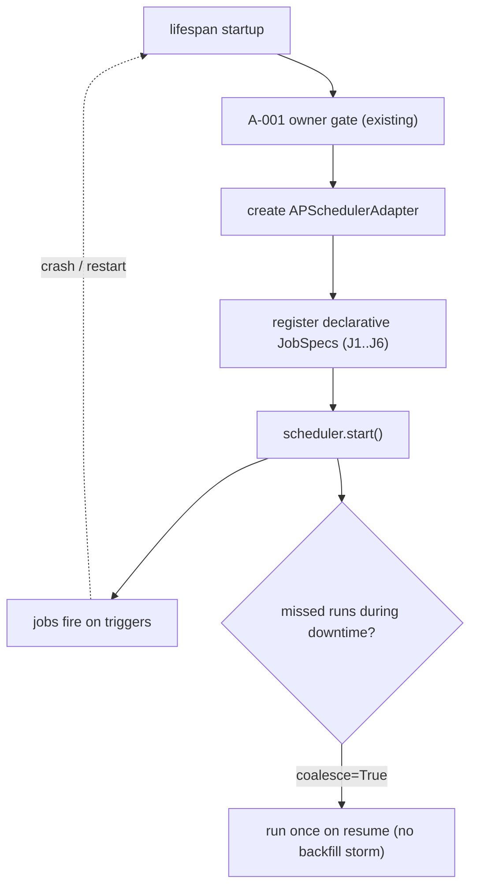

# Scheduler Recovery Model (AP-103, design)

> Restart-safety and idempotency design for the scheduler (constraint 10). Design only.
> Pairs with `scheduler-failure-model.md`.

---

## 1. Restart-safety principle

The scheduler holds **no durable state of its own** in v1. Jobs are **declarative** (fixed
triggers) and **idempotent**, so correctness does not depend on persisting the scheduler's queue.
On every startup the lifespan re-registers the same `JobSpec` set deterministically.

## 2. Idempotency per job (why missed/duplicate runs are safe)

| Job | Idempotency mechanism (existing) |
|---|---|
| J1 Research | URL/title dedup in `_deduplicate_findings`; per-finding checkpoints; `resume_research_run` |
| J2 Briefing | `content_hash` dedup (a duplicate run with identical 24h data persists nothing new); `resume_briefing_run`; outbox de-dups per `correlation_id` |
| J3 Approval expiry | selects only `PENDING` + overdue; re-running selects an empty/strict-subset set |
| J4 Metrics aggregation | per-`(metric, hour, window)` dedup before insert (existing) |
| J5 Outbox health | read-only; no side effects |
| J6 Checkpoint health | read-only; no side effects |

Because each job is idempotent, the scheduler may use the in-process `MemoryJobStore`: losing the
queue on restart is harmless, and re-registration restores all jobs.

## 3. Missed-run policy (downtime)

- **`coalesce=True`** — if multiple fires were missed during downtime, run **once** on resume rather
  than replaying each missed interval (avoids a thundering-herd on boot).
- **`misfire_grace_time`** — a small grace (e.g. 300s) lets a run that just missed its slot still
  execute; beyond that it waits for the next scheduled slot.
- **Daily briefing** uses a cron trigger; a missed day is **not** back-filled (a stale yesterday
  briefing has no value) — by design it simply runs at the next scheduled time.

## 4. Crash-during-job recovery

- Jobs run inside `get_session` → partial work **rolls back** on crash (no half-written state).
- Engine-style workflows (research/briefing) additionally checkpoint, so a re-run resumes or
  safely re-derives via dedup.
- No job leaves a lock or lease that requires manual cleanup (the comm-outbox lease is owned by the
  existing outbox loop, not by these jobs).

## 5. Relationship to the existing recovery framework

This scheduler **does not** implement the generic "scan-and-auto-resume incomplete workflows"
supervisor noted as missing in the audit (TD-22). J6 (Checkpoint Health) only **observes** stale
executions/checkpoints and surfaces them via metrics/audit; it does **not** resume them. A true
recovery supervisor remains a **separate, future** item (out of A-003 scope) — flagged here so the
boundary is explicit.

## 6. Future distributed scheduling (constraint 6)

The `SchedulerPort` abstraction and idempotent jobs make the path forward clean:
- Swap `MemoryJobStore` → a persistent/clustered jobstore (e.g. `SQLAlchemyJobStore`) for
  single-node durability, or
- Replace `APSchedulerAdapter` with a distributed scheduler adapter (e.g. external cron/queue),
  leaving jobs and services untouched.
- A distributed deployment additionally requires **leader election / single-fire** guarantees
  (so a job fires once cluster-wide); idempotency limits the damage of accidental double-fires in
  the interim. This is explicitly **out of v1 scope** — the design merely keeps the door open.
