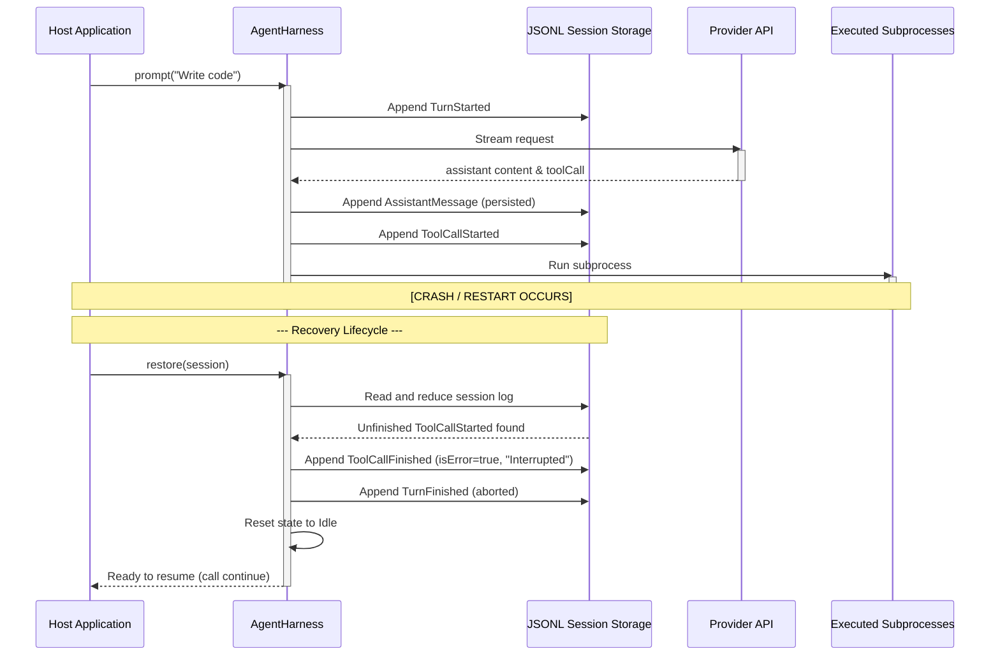

# Pi Framework — Pi Agent Harness Analysis Report

Date: 2026-06-19
Status: Completed
Author: Antigravity Coding Assistant

---

## 1. Executive Summary

This report performs a system-design and lifecycle analysis of the **Pi Agent Harness** (`AgentHarness` and the accompanying state architecture). We focus on how Pi orchestrates its loops, manages runtime lifecycles, and guarantees durability and recovery. These architectural findings are translated into structured recommendations for the **Nexus Memory and Execution Layers**.

---

## 2. Agent Harness & Loop Execution Design

The `AgentHarness` acts as the transaction coordinator above the low-level `agentLoop` state machine. It handles queue management, persistence side-effects, and resource resolution.

### Control Flow and Sub-Loop Orchestration

```
+--------------------------------------------------------+
|                      AgentHarness                      |
|                                                        |
|   +------------------------------------------------+   |
|   |                  Reasoning Loop                |   |
|   |   (Evaluates context & model requirements)     |   |
|   +------------------------------------------------+   |
|                           |                            |
|                           v                            |
|   +------------------------------------------------+   |
|   |                  Execution Loop                |   |
|   |   (Invokes LLM stream, processes deltas)       |   |
|   +------------------------------------------------+   |
|                           |                            |
|                           v                            |
|   +------------------------------------------------+   |
|   |                    Tool Loop                   |   |
|   |   (Resolves tool specs, executes batches)      |   |
|   +------------------------------------------------+   |
|                           |                            |
|                           v                            |
|   +------------------------------------------------+   |
|   |                  Recovery Loop                 |   |
|   |   (Drains steer queues, resolves crashes)      |   |
|   +------------------------------------------------+   |
+--------------------------------------------------------+
```

1. **Reasoning Loop**: Decides model configurations, thinking budget (budgets token levels from `minimal` to `high`), and system prompt modifiers.
2. **Execution Loop**: Runs the LLM stream, yielding incremental token deltas (`message_update`) and buffering complete assistant messages before tool invocation.
3. **Tool Loop**: Normalizes tool calls. It decides if tool execution is parallel or sequential. Sequential execution is forced if even *one* tool in the batch sets `executionMode: "sequential"`.
4. **Recovery Loop**: Evaluates context constraints and handles interruptions by reading append-only logs.

---

## 3. Event-Driven State & Memory Architecture

Pi uses an event-driven state architecture where all state mutations are written as entries to a durable log tree.

### State Transition & Checkpointing

```
+---------------+      prompt()       +---------------+
|   Idle State  | ------------------> |  Turn Started |
+---------------+                     +---------------+
        ^                                     |
        |                                     | Stream response
        |                                     v
        |                              +---------------+
        |                              | Message Ended |
        |                              +---------------+
        |                                     |
        |             save_point              | Execute tools
        |             checkpoint              v
        |                              +---------------+
        +----------------------------- |   Turn Ended  |
                                       +---------------+
```

### Durability and Event Log Mechanics
- **Append-Only Logging**: Rather than updating an active record in place, Pi appends every transition as a log entry:
  ```ts
  type DurableHarnessEntry =
    | TurnStartedEntry
    | TurnFinishedEntry
    | ToolCallStartedEntry
    | ToolCallFinishedEntry
    | ActiveToolsChangeEntry;
  ```
- **State Checkpoints (Save Points)**: A `save_point` is committed immediately after `turn_end` is emitted. This ensures that the message history and tool executions of a turn are completely flushed to disk before any subscriber callbacks run.
- **Tree Branching (`leaf` cursor)**: A session tree has a `leaf` pointer tracking the active conversation node. Re-opening a storage log reads the latest leaf pointer to reconstruct the state history dynamically.

### Actionable Recommendations for Nexus
- **Durable Audit Ledger**: Build Nexus's `AuditLogRecord` table as a true immutable, append-only log. Every state change (e.g. `TaskStatus`, `ApprovalStatus`, `ExecutionStatus` updates) must insert a new record rather than modifying history.
- **Save Point Transactions**: In Nexus, execute state updates and audit logging inside a single SQLite transaction block that commits before external notifications (such as sending a Discord message or executing a shell subprocess) are fired.

---

## 4. Agent Runtime Lifecycle & Crash Recovery

The runtime lifecycle of an agent must withstand mid-execution process crashes. Pi Core implements detailed crash boundaries.

### Sequence Diagram: Lifecycle and Interruption Recovery



### Crash Recovery Policies
1. **Unfinished Turns**: If the process crashes during an active provider stream or execution, the session reduction detects a missing `TurnFinishedEntry` or `ToolCallFinishedEntry`. It appends an "Interrupted" result to prevent orphan runs.
2. **Unfinished Tool Runs**: Tools are classified by idempotency. If a tool crashes and is not declared `retry-safe`, it is marked as failed, and automatic re-execution is blocked. The agent must prompt the user or state engine for steering.
3. **Queue Preservation**: In-flight message queues (steering/follow-up) are flushed to disk before operations run. If a crash occurs, they are restored during log reduction rather than lost in memory.

### Actionable Recommendations for Nexus
- **Heartbeat & Orphan Detection**: Ensure `ExecutionRecord` has a `last_heartbeat` and `timeout_threshold`. A background scheduler task (APScheduler) must sweep the database for tasks that missed heartbeats, mark them as `failed` or `timed_out` with an error exit status, and log an audit trail event.
- **Idempotency Metadata**: Add an `idempotent` boolean field or runner metadata to execution tasks. If a task fails or crashes, allow automatic retries only if `idempotent` is `True`.
