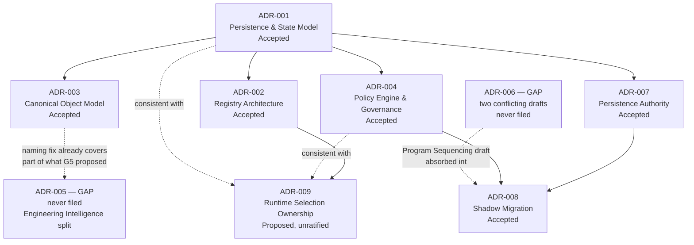
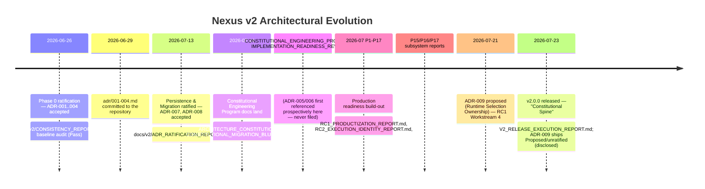

# Documentation Phase 5 Report — Architectural Decision Integrity

**Status: Complete. No implementation or architecture change was made.** This phase touched exactly two
files beyond this report: `adr/README.md` (expanded into the canonical ADR index, per §4) and
`docs/v2/ADR_RATIFICATION_REPORT.md` (one new section recording the gaps found, per §2). No ADR was
authored, no decision was ratified or invented, and no `nexus_*` package, test, or CI file was touched.

---

## 1. ADR Audit

Every ADR file in `adr/` was read in full (`ADR-001` through `ADR-004`, `ADR-007-persistence-authority.md`,
`ADR-008-shadow-migration.md`, `ADR-009-runtime-selection-ownership.md` — seven files, matching
`adr/README.md`'s own count before this phase). Findings:

### 1.1 Numbering and chronology

| Check | Result |
|---|---|
| Files present | `001`–`004`, `007`–`009` (seven files). `005`/`006` do not exist — investigated in full in §2. |
| Chronological order matches numeric order | **Yes.** Git history confirms `001`–`004` landed together (`3d33c1c`, 2026-06-29, dated 2026-06-26 in each header), `007`/`008` landed together five weeks later (`a62797d`, 2026-07-14, dated 2026-07-13), `009` landed a week after that (`ecb1057`, 2026-07-21). No file's stated date precedes its predecessor's, and no file was ever renumbered. |
| Every ADR self-declares Status/Date/Deciders/Relates/Affected-work | **Yes**, uniformly, across all seven files — a consistent header format was followed from `001` onward and never dropped. |
| Superseded ADRs | **None.** No ADR in this series has been superseded, revised, or retracted; each is either `Accepted` (six) or `Proposed`/unratified (one — `009`). |
| Numbering collisions with v1's independent `blueprint/DECISIONS/` series | **Full collision map added to `adr/README.md`** (this phase's edit) — every v2 number `001`–`010` has an unrelated, same-numbered v1 file. This is by design (two products, two series) and was already partly disclosed (007/008); this phase extended the disclosure to the full range and, materially, to **ADR-010** (§1.3). |

### 1.2 Cross-references and implementation references

Every ADR's "Relates"/"Affected Action Points"/"Affected work" header field was checked against what it
claims to touch:

- **ADR-001** → `nexus_core/persistence/interfaces.py`, `nexus_infra`'s event store/projection/checkpoint
  trio. Verified present and matching the ADR's own description (event log authoritative, state and
  checkpoints as derived projections).
- **ADR-002** → `nexus_runtime`'s allocation/Harness code, `nexus_orchestration`. Verified: `nexus_runtime`
  is where `RuntimeSelector`/allocation lives (confirmed directly while investigating ADR-009, §1.2 below),
  matching ADR-002's "Runtime is a Harness of category Runtime" decision.
- **ADR-003** → `contracts/goal.md`, `contracts/intent.md`. Verified both contracts carry the exact
  "Intent Resolution is canonical; Executive Intelligence is a deprecated alias" language ADR-003 §3.5
  specifies, correctly attributed to ADR-003 by name in both files — this is a real, working example of an
  ADR being traceable all the way to a frozen contract with no drift.
- **ADR-004** → `nexus_policy`. Verified the package exists and is the single named consumer across every
  later document that discusses governance.
- **ADR-007/008** → both ratify their own P0 spike documents (`docs/v2/P0_ADR007_PERSISTENCE_SPIKE.md`,
  `docs/v2/P0_ADR008_SHADOW_MIGRATION_SPIKE.md`), which exist and are cited nowhere else inconsistently.
- **ADR-009** → `nexus_runtime/allocation.py`, `nexus_execution/actuation/dispatch.py`. Both files exist;
  `ADR-009`'s own body (read in full during the prior phase's grounding work, and re-confirmed here) already
  documents the file:line evidence for the ownership contradiction it proposes to resolve — this is the one
  ADR in the series that is honestly, consistently marked **Proposed/unratified** everywhere it is cited
  (`adr/README.md`, `CHANGELOG.md`, `docs/v2/V2_RELEASE_EXECUTION_REPORT.md`), which is exactly what a
  trustworthy unratified-decision record should look like.

**No implementation reference in any of the seven files was found to be false, stale, or unverifiable.**

### 1.3 A numbering collision this audit found and disclosed: ADR-010

While tracing every `ADR-010` reference repository-wide (triggered by investigating the 005/006 gap, since
010 is the next unwritten v2 number after it), this audit found that **v2's own planned ADR-010**
(correlation-event gateway / INV-39 transport freeze — already correctly marked "remains unwritten" in
`adr/README.md`) sits at the same number as **v1's real, ratified, actively-cited ADR-010**
(`blueprint/DECISIONS/ADR-010-execution-timeouts.md`, cited directly in shipped v1 code:
`nexus/execution/runners/base.py`, `claude.py`, `gemini.py`, `nexus_agent.py`, and
`docs/v1/ORCHESTRATION.md` §6.1). Neither `adr/README.md` nor `ADR_RATIFICATION_REPORT.md` previously said
this out loud — a reader searching the repo for "ADR-010" would land on v1's real, implemented decision and
could easily mistake it for v2's unwritten one, or vice versa. **This is not a gap or an error** — v1's
ADR-010 is completely legitimate — but it was an undisclosed collision, now fixed in both files (§4).

### 1.4 ADR dependency graph

---

## 2. ADR-005/006 Investigation

Per this phase's explicit instruction ("do NOT immediately write ADRs... evidence first"), the question
was answered by evidence before any conclusion was drawn, in this order: (1) search all git history for
the files, (2) enumerate every reference to determine what each number was actually claimed to mean,
(3) check whether the referenced decisions were ever substantively carried out in shipped code, (4) form a
verdict.

### 2.1 Did the files ever exist?

**No.** `git log --all --diff-filter=D --name-only -- "*ADR-005*" "*ADR-006*"` and a full-history filename
search across every branch return nothing for `adr/ADR-005*.md` / `adr/ADR-006*.md`. The only matches
anywhere in git history for those filenames are `blueprint/DECISIONS/ADR-005-agent-routing.md` and
`ADR-006-approved-tech-stack.md` — v1's unrelated, independently-numbered series, already understood and
disambiguated. **There is nothing to recover under Outcome A.** This also rules out a simple renumbering
or accidental deletion — the v2 `adr/` directory's earliest commit (`3d33c1c`, 2026-06-29) added exactly
`001`–`004` and nothing else; no commit ever added, then removed, a `005` or `006` file.

### 2.2 What were ADR-005 and ADR-006 actually supposed to be?

Every reference was read in its original context (not just the master plan's summary of them):

**ADR-005** is consistently described the same way across `ARCHITECTURE_CONSTITUTION.md`,
`CONSTITUTIONAL_MIGRATION_BLUEPRINT.md`, `IMPLEMENTATION_READINESS_REVIEW.md`, and
`P0_ADR008_SHADOW_MIGRATION_SPIKE.md`: **reinstate Engineering Intelligence as its own "Reason" capability,
retire the name "Executive Intelligence," and move "classify kind of work / estimate complexity" out of
Intent Resolution and into Engineering Intelligence.** This is a genuinely different decision from
`ADR-003` §3.5 (the naming fix, already ratified 2026-06-26) — ADR-003 only decided *what to call* the
existing Intent-Resolution-shaped layer; the ADR-005 proposal is a *capability split*, carving a new,
distinct owner out of it. Every citation uses prospective language ("to ratify," "Constitutional — ratify
via new ADR-005") — none claims the decision is already accepted.

**ADR-006 has two different, mutually incompatible definitions**, both written into documents that landed
in the same commit (`a62797d`, 2026-07-14):

- **Definition A** (`ARCHITECTURE_CONSTITUTION.md` line 533, `CONSTITUTIONAL_MIGRATION_BLUEPRINT.md` line
  234, `IMPLEMENTATION_READINESS_REVIEW.md` line 150): "name the Policy Engine, Repository Intelligence,
  Human Interaction, Actuation, Operations as first-class subsystems with their own packages."
- **Definition B** (`CONSTITUTIONAL_ENGINEERING_PROGRAM.md` §7 and its own WP-P0.7 work package, whose
  literal planned output filename is `ADR-006-program-sequencing.md`): "ratify ADR roadmap ordering —
  Policy Engine + ADR-007/008 front-loaded ahead of the rest of the program."

Neither document acknowledges the other's claim on the same number. This is a genuine Phase-0-era planning
inconsistency, not a numbering typo — the two topics are unrelated (subsystem naming vs. build-order
sequencing) and both are written as fully-formed decision descriptions, not placeholders.

### 2.3 Was either decision's substance actually carried out?

**Yes, both were — just never formalized as standalone ADR files:**

- **ADR-005's substance shipped.** `nexus_engineering/` exists as a real package (`composition.py`,
  `engine.py`, `model.py`), and the root `README.md`'s own capability table lists **"Engineering
  Intelligence"** as one of the platform's thirteen named capabilities, under the Reasoning & Grounding
  plane — exactly the name ADR-005 proposed reinstating. The "Executive Intelligence" alias it was meant to
  retire is **not** a live contradiction: every place it still appears
  (`contracts/goal.md`, `contracts/intent.md`, `docs/v2/01_ARCHITECTURE.md`, `docs/v2/02_OBJECT_MODEL.md`)
  correctly frames it as a deprecated historical alias attributed to ADR-003 — that part of the
  terminology fix propagated cleanly. What never happened is a standalone record of the *later, distinct*
  decision to split Engineering Intelligence out as its own capability.
- **ADR-006 Definition B's substance was ratified — just absorbed elsewhere.** `ADR_RATIFICATION_REPORT.md`
  itself already states (§4, readiness condition C6): "Substantially closed — both front-loaded decisions
  ratified; Policy-first order is now authoritative in **ADR-008**." The sequencing decision Definition B
  wanted to record as its own ADR-006 was instead folded into ADR-008's text. The number was simply never
  used because the decision found a home elsewhere.
- **ADR-006 Definition A's substance mostly shipped.** `nexus_policy`, `nexus_repository`,
  `nexus_human_interaction`, and `nexus_operations` all exist as dedicated packages, matching four of the
  five names Definition A proposed. The fifth, Actuation, does **not** have its own package — but this is
  not a gap relative to Definition A's intent: the Constitution and the root README both consistently
  describe Actuation as a composite stage (Orchestration selects, Harness compiles, Runtime Manager
  allocates, Execution Engine runs), never as a candidate for its own package, so its absence is consistent
  design, not an unfulfilled naming decision.

### 2.4 Verdict

**A hybrid of Outcomes B and C — closer to C in substance, but not identical to either as originally
framed:**

- Strictly by Outcome B ("never existed"): true. Neither file ever existed; nothing was lost; nothing needs
  recovering.
- But unlike a pure Outcome B, the referenced decisions were **not aspirational fiction** — they were real,
  were substantively acted on, and shipped in the released `v2.0.0` platform. Simply deleting every
  ADR-005/006 reference (Outcome B's "remove incorrect references") would erase an accurate record of *why*
  `nexus_engineering` and the four named packages exist, which is not the right fix either.
- The best-evidenced explanation is Outcome C, **made explicit for the first time here**: these two
  decisions were real but never the *irreversible, blocking* kind — `ADR_RATIFICATION_REPORT.md`'s own
  words about ADR-007/008 apply by contrast: those were ratified first because they were "the two hardest,
  most blocking decisions." ADR-005/006 (naming and capability-split decisions with "no invariant change;
  no code yet exists for either" per `CONSTITUTIONAL_MIGRATION_BLUEPRINT.md`'s own risk assessment) were
  lower-urgency, got implemented directly once the relevant build phase arrived, and the ADR paperwork was
  never circled back to. This was never stated anywhere before this investigation — it was simply silence.

**No ADR is written or fabricated by this phase.** Per the governing instruction, formalizing (writing
`ADR-005`/`ADR-006` now, retroactively, citing the real implementation dates as evidence) or the
alternative of a clean deprecation notice on every stale reference remain genuine options for future work
— documented as a recommendation in §7, not performed here.

---

## 3. Traceability Matrix

**Decision → Implementation → Report → Release**, for every ADR plus the two gaps:

| ADR | Implementation | Report(s) that verify it | Release |
|---|---|---|---|
| ADR-001 (Persistence & State) | `nexus_core/persistence/interfaces.py`, `nexus_infra` event store/projections/checkpoints | `docs/v2/RC1_PRODUCTIZATION_REPORT.md` §6 (measured replay/restart performance against this model) | v2.0.0 |
| ADR-002 (Registry Architecture) | `nexus_runtime` (Harness/allocation), `nexus_orchestration` | `docs/v2/CONSISTENCY_REPORT.md` (Phase 0 baseline check #1, "every ADR referenced correctly") | v2.0.0 |
| ADR-003 (Canonical Object Model) | `contracts/goal.md`, `contracts/intent.md`, `contracts/work_package.md` | same Phase 0 Consistency Report; re-verified directly by this phase (§1.2) | v2.0.0 |
| ADR-004 (Policy Engine & Governance) | `nexus_policy` | `docs/v2/V2_RELEASE_EXECUTION_REPORT.md` §4 (test suite: 3215 passed, 0 failed, includes Policy Engine coverage) | v2.0.0 |
| **ADR-005 — gap** | `nexus_engineering` (substance shipped; no ADR record) | none — this is the traceability break this investigation exists to name | v2.0.0 (undocumented as a decision) |
| **ADR-006 — gap** | `nexus_policy`/`nexus_repository`/`nexus_human_interaction`/`nexus_operations` (Definition A substance); ADR-008 text (Definition B substance) | `ADR_RATIFICATION_REPORT.md` §4 covers Definition B only, under ADR-008's own closure, not under a 006 record | v2.0.0 (Definition A undocumented; Definition B documented under the wrong ADR number) |
| ADR-007 (Persistence Authority) | `nexus_core/persistence/interfaces.py` | `docs/v2/ADR_RATIFICATION_REPORT.md` (ratifies this ADR directly), `docs/v2/RC1_PRODUCTIZATION_REPORT.md` §6 | v2.0.0 |
| ADR-008 (Shadow Migration) | Feature-flagged per-owner migration mechanism | `docs/v2/ADR_RATIFICATION_REPORT.md`; `CHANGELOG.md` [2.0.0] notes "documents a designed-but-unbuilt migration path — v2 today only" (an honestly disclosed limitation, not a defect) | v2.0.0 |
| ADR-009 (Runtime Selection Ownership) | `nexus_runtime/allocation.py`, `nexus_execution/actuation/dispatch.py` | `docs/v2/P17_PRODUCTION_READINESS_REPORT.md` (the finding this ADR proposes to resolve); `CHANGELOG.md` [2.0.0] ("ADR-009 remains unratified... carried forward") | v2.0.0 (shipped Proposed/unratified — disclosed) |

### Implementations flagged as untraced to any ADR

Per this phase's instruction ("if an implementation cannot be traced to an ADR, flag it — do not create
retrospective ADRs unless evidence supports doing so"), three subsystems shipped in `v2.0.0` with a design
report but **no governing ADR of any kind**, unlike Persistence/Registry/Object-Model/Policy above:

- **Scheduler and Autonomy** (`nexus_scheduler`, the `AutonomyMode` tiering) — designed in
  `docs/v2/P16_AUTONOMY_AND_SCHEDULED_OPERATIONS_REPORT.md`, but no ADR records the decision to introduce
  three autonomy tiers or how they interact with Policy.
- **Approval Exchange and Operations** (`nexus_approval`, `nexus_operations`) — designed in
  `docs/v2/P15_APPROVAL_EXCHANGE_AND_OPERATIONS_REPORT.md`; Operations' *existence as a named subsystem* is
  covered by ADR-006 Definition A's substance (§2.3) even though that ADR was never filed, but the Approval
  Exchange's own design (gate lifecycle, `publish`/`approve`/`deny`) has no ADR at all.
- **Estimation** — `ADR_RATIFICATION_REPORT.md` §3 itself already lists this as open work ("C3 —
  Estimation... not yet decided"); this phase confirms it remains untraced to any ADR, consistent with
  that report's own disclosure rather than a new finding.

None of these are recommended for a retrospective ADR by this phase — per the explicit instruction, evidence
of "should this have been an ADR" is a design judgment for the team, not something a documentation pass
decides. They are flagged, not resolved.

---

## 4. ADR Index (expanded)

`adr/README.md` is now the canonical navigation page, expanded per this phase's requirement to include,
per ADR: Title, Status, Date, Motivation, Impacted subsystems, Related ADRs, Implementation references, and
Release introduced — plus a new, explicit numbering-collision table covering every v2 number `001`–`010`
against its unrelated v1 counterpart (previously only `007`/`008` were disambiguated there). See
[`adr/README.md`](../adr/README.md) directly rather than duplicating the table here — this report links to
it per the instruction not to repeat what already has one authoritative source.

`docs/v2/ADR_RATIFICATION_REPORT.md` gained one new section (§5) recording the ADR-005/006 gap and the
ADR-010 collision in the file whose job is tracking exactly this kind of thing — previously silent on both,
per the original master-plan audit's own criticism ("the file whose entire job is tracking ADR status
never mentions this gap").

---

## 5. Constitution Consistency

Checked for conflicting descriptions of system behavior across the Constitution, ADRs, architecture
documentation, release reports, and the example library (Phase 4's deliverable):

| Pair checked | Result |
|---|---|
| Constitution's 13-capability model vs. ADR-002's four-registry model | Consistent — the Constitution names capabilities (what owns a decision); ADR-002 names registries (where definitions/state live). No capability is claimed to own two registries' worth of state. |
| Constitution's naming ("Intent Resolution") vs. contracts vs. older design docs (`01_ARCHITECTURE.md`, `02_OBJECT_MODEL.md`) | Consistent — every occurrence of the older name "Executive Intelligence" is correctly marked as a deprecated historical alias attributed to ADR-003, in every file checked (§1.2, §2.3). No live contradiction found. |
| Constitution's "Engineering Intelligence" capability vs. the never-ratified ADR-005 | The capability is real and shipped (`nexus_engineering`); the Constitution asserts it without the ADR that was supposed to formalize it (§2.4) — a documentation gap, not a behavioral contradiction: nothing in the Constitution or the shipped code disagrees about what Engineering Intelligence *is* or *does*. |
| ADR-004's determinism boundary ("deterministic coordination/governance, non-deterministic cognition") vs. root `README.md`'s "Why Nexus is Different" section | Consistent — the README's "Deterministic, not best-effort" and "Evidence-validated, not self-reported" claims match ADR-004 §3.5 and ADR-001 §3.6 (capture-as-data, never recompute on replay) exactly; no exaggeration beyond what the ADRs actually decided. |
| RC1/RC2 release reports' measured claims (replay/restart latency, concurrent-goal identity) vs. ADR-001's projection model | Consistent — `RC2_EXECUTION_IDENTITY_REPORT.md`'s fix (concurrent goals replay independently) is a bug fix *within* ADR-001's model (idempotency, event identity), not a change to the model itself; no ADR amendment was needed or claimed. |
| Example library (Phase 4) vs. every ADR/Constitution claim it demonstrates | Consistent — verified no example references "Executive Intelligence," ADR-005, or ADR-006 (`grep` across `examples/` returns nothing); every example uses the real, ratified APIs (`SpineRequest`, `ApprovalExchange`, `Scheduler`, `PolicyEngine`) that trace to ADR-001/002/003/004, with no example asserting behavior an ADR contradicts. |
| `docs/v2/CONSISTENCY_REPORT.md`'s Phase-0 "every ADR referenced correctly ✅ Pass" vs. this phase's findings | **Not a contradiction — a scope difference.** That report is dated 2026-06-26, the same day as ADR-001–004 and three weeks *before* `ARCHITECTURE_CONSTITUTION.md` (2026-07-14) ever introduced an ADR-005/006 reference. Its "Pass" verdict is accurate for what existed on the day it was written; it was never re-run after the gap was introduced. This is stated explicitly here so a reader doesn't take that report's "Pass" as covering ADR-005/006 — it doesn't, and was never able to. |

**No conflicting description of system behavior was found.** Every inconsistency this phase surfaced is a
*documentation-completeness* gap (a decision made but never filed as an ADR, or a report whose scope predates
a later reference) — never two documents disagreeing about what the platform actually does.

---

## 6. Historical Timeline

Links to existing ADRs and reports rather than repeating their content:

**Original platform → Constitutional engineering → Production readiness → RC1 → RC2 → v2.0.0**, per the
governing prompt's own framing, maps directly onto the above: "Original platform" is Phase 0
(2026-06-26 ratification); "Constitutional engineering" is the 2026-07-14 Constitution/Migration
Blueprint/Engineering Program landing; "Production readiness" is the P1–P17 build-out; "RC1" is
`RC1_PRODUCTIZATION_REPORT.md` plus ADR-009's proposal; "RC2" is `RC2_EXECUTION_IDENTITY_REPORT.md`; and
"v2.0.0" is the 2026-07-23 release this session's own earlier phases have been documenting throughout.

---

## 7. Validation

- **Every ADR link resolves.** Checked every relative link added to `adr/README.md` and
  `docs/v2/ADR_RATIFICATION_REPORT.md` against the filesystem (anchors stripped before checking, per the
  Phase 4 link-checker methodology) — all resolve.
- **Every implementation reference exists.** `nexus_core/persistence/interfaces.py`, `nexus_runtime`,
  `nexus_policy`, `nexus_engineering`, `nexus_repository`, `nexus_human_interaction`, `nexus_operations`,
  `nexus_execution/actuation/dispatch.py`, `contracts/goal.md`, `contracts/intent.md`, and every
  `blueprint/DECISIONS/ADR-*.md` file cited in §1.3's collision map were confirmed present on disk before
  being cited (§1.2, §1.3, §2.3, §3).
- **No missing ADR number remains unexplained.** `005` and `006` are now investigated in full (§2); the
  previously-undisclosed `010` v1/v2 collision is now disclosed (§1.3, and fixed directly in
  `adr/README.md`/`ADR_RATIFICATION_REPORT.md`, §4). No other gap in the `001`–`010` range was found.
- **No contradictory architectural statement remains** beyond the documentation-completeness gaps already
  named and explained in §5 — none of which is a behavioral contradiction (§5's own conclusion).
- **Scope discipline:** `git status --short` after this phase's edits shows exactly three files changed —
  `adr/README.md`, `docs/v2/ADR_RATIFICATION_REPORT.md`, and this report — no `nexus_*/` package, test, CI,
  or contract file was modified, and no ADR file was authored or altered.

---

## 8. Remaining Documentation Work

Explicitly not started this phase, per its own closing instruction ("do not begin benchmarks, tutorials,
release cadence, contributor documentation, or marketing material"):

1. **Whether to formalize ADR-005/006.** Two options now precisely scoped by §2's investigation, neither
   performed here: (a) file both now as catch-up ADRs, dated to when their substance actually shipped
   (`nexus_engineering`'s introduction for 005; the relevant package-creation commits for 006's Definition
   A), explicitly marked as retrospective; or (b) leave them as documented, explained gaps and instead trim
   every remaining prospective "to ratify" reference to point at this report instead. Both are future work
   requiring a team decision, not a documentation-pass judgment call.
2. **The three untraced implementations from §3** (Scheduler/Autonomy, Approval Exchange, Estimation) —
   flagged, not resolved. Whether any warrants a retrospective ADR is an architectural judgment outside this
   phase's mandate.
3. **Tutorials, benchmarks, release cadence, contributor-process improvements, marketing material** — all
   explicitly excluded from this phase by name; unchanged from their status at the end of Phase 4.
4. **`docs/concepts/` and `docs/guides/`** — still no real content behind either, carried forward unchanged
   from Phase 3.

Per the governing prompt: stopping here.
