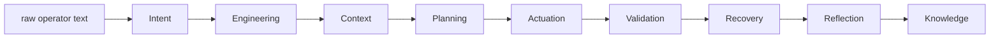

# 01 — Hello Nexus

## Purpose

The smallest possible runnable Nexus v2 program: one Goal, driven to completion, through the real
Constitutional Pipeline. If you run nothing else in this examples library, run this one — it proves
the platform works end to end in under 15 lines of actual logic.

## Prerequisites

See [examples/README.md](../README.md#prerequisites-all-examples). No additional setup for this
example specifically.

## Architecture



This is the full nine-stage Constitutional Pipeline (`nexus_workflows.spine`), narrated here at the
"what happened" level — `02-first-pipeline` walks through each stage explicitly and observes the
result through the Operations plane.

## Code Walkthrough

```python
infra = build_infrastructure()                        # one in-memory, append-only event log
pipeline = build_constitutional_pipeline(infra)        # wires every constitutional owner over it
request = spine_reference_request(run="hello")         # raw operator text -> a SpineRequest
run = pipeline.coordinator.run(request)                # drives all nine stages in order
```

- `build_infrastructure()` (`nexus_infra`) gives an in-memory durable log — no file, no cleanup,
  perfect for a first run.
- `build_constitutional_pipeline(infra)` (`nexus_workflows.spine`) is the same composition root
  `python -m nexus_scheduler` uses in production — it just points at a different infrastructure.
- `spine_reference_request` is the platform's own reference Goal builder, used throughout the test
  suite — not a bespoke example fixture. It defaults to the built-in Claude stub runtime, so no real
  LLM call happens.
- `pipeline.coordinator.run(request)` is the one call that does everything: Intent Resolution reads
  the text, Engineering reasons about it, Context assembles what's needed, Planning builds the work,
  Actuation executes it, Validation judges the result, Recovery decides what (if anything) happens
  next, Reflection looks for a pattern, and Knowledge records it durably.

## Expected Output

```
status:          completed
succeeded:       True
stages executed: intent, engineering, context, planning, actuation, validation, recovery, reflection, knowledge
knowledge items: ('ki-lesson-architecture-generation-summary',)
```

(Captured from a real run against `v2.0.0`. Ordering and identifiers are deterministic — this exact
output is expected every time you run it.)

## Troubleshooting

- **`ModuleNotFoundError`**: run `uv sync` from the repository root first.
- **Different `knowledge items` identifier**: don't expect it — this is deterministic. If you see a
  different value, something in your environment has changed the reference request or the platform
  version; check `git status` and `git log -1`.

## Next Example

[02 — First Pipeline](../02-first-pipeline/) — the same run, with every stage narrated explicitly and
observed afterward through the read-only Operations plane.
