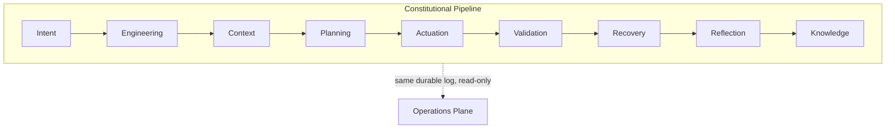

# 02 — First Pipeline

## Purpose

Names every one of the nine constitutional stages explicitly, and then observes the completed run
through a second, independent subsystem — the Operations plane — to prove it never had to trust the
`run` object it already had in hand: the same facts are visible from the durable log alone.

## Prerequisites

See [examples/README.md](../README.md#prerequisites-all-examples). Builds on
[01 — Hello Nexus](../01-hello-nexus/).

## Architecture



## Code Walkthrough

```python
approval = build_approval_exchange(pipeline.coordinator, infra)
operations = build_operations(pipeline.coordinator, approval, infra)
```

Operations is wired over the *same* pipeline and the Approval Exchange, but it has no method that
starts, stops, or influences a run — only read-only lookups (`session_lookup`, `runtime_inventory`,
`replay_inventory`, and others; see `nexus_operations/service.py`). This is what "observation, never
control" means concretely: the class simply doesn't expose a way to act.

```python
summary = operations.service.session_lookup(session_id)
```

`session_lookup` reconstructs a `SessionSummary` from the durable log for the given session id — the
same session id (`request.pipeline_session_id`) the pipeline itself used, but Operations never
received the `run` result object; it derives everything itself.

## Expected Output

```
Submitting one Goal. It will drive all nine constitutional stages in order:
  Intent -> Engineering -> Context -> Planning -> Actuation
    -> Validation -> Recovery -> Reflection -> Knowledge

-- Result --
status:            completed
stages executed:   ('intent', 'engineering', 'context', 'planning', 'actuation', 'validation', 'recovery', 'reflection', 'knowledge')
execution outcomes:('completed', 'completed')
validation:        ('passed', 'passed')
recovery:          ('complete', 'complete')
knowledge items:   ('ki-lesson-architecture-generation-summary',)

-- Operations plane view of the same session --
session id:        pipe-spine-arch-first-pipeline
status:            completed
stages completed:  ('intent', 'engineering', 'context', 'planning', 'actuation', 'validation', 'recovery', 'reflection', 'knowledge')
pending approvals: 0
```

## Troubleshooting

- **`AttributeError` on `SessionSummary`**: its fields are `session_id`, `status`, `current_stage`,
  `stages_completed`, `pending_approvals`, `is_paused` — see `nexus_operations/model.py` if you extend
  this example and need a field not printed here.

## Next Example

[03 — Policy Governance](../03-policy-governance/) — the subsystem every stage above actually
consults before acting, shown standalone.
