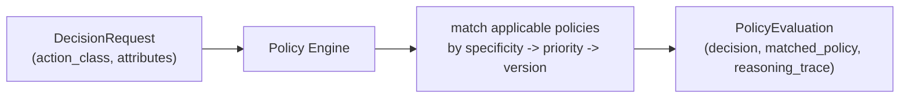

# 03 — Policy Governance

## Purpose

Demonstrates the Policy Engine standalone — the single, fail-closed governance owner every other
subsystem consults before acting (INV-30: an action with no matching policy is denied, never
allowed). Shows the *same* action class evaluated twice with different attributes, producing two
different, fully explained verdicts.

## Prerequisites

See [examples/README.md](../README.md#prerequisites-all-examples). Builds on
[02 — First Pipeline](../02-first-pipeline/).

## Architecture



## Code Walkthrough

```python
policy = build_policy(infra)  # seed=True by default: registers the v1-migrated defaults
```

`seed=True` registers the platform's real, shipped default policies — including
`policy.execution.allow-baseline` and a deny rule for `GLOBAL_COMMAND_BLACKLIST`
(`nexus_policy/defaults.py`) — not policies invented for this example.

```python
policy.engine.evaluate(DecisionRequest(
    action_class=EXECUTION_ACTION_CLASS,
    correlation_identifier="cor-allowed-example",
    attributes={"runtime": "claude", "runtime_policy": "approved", "command": "pytest tests/unit"},
))
```

Every `DecisionRequest` is a query, never a command — the engine only ever answers "is this allowed,"
it never performs the action itself (that separation is the whole point: Policy decides, it never
acts). The two example commands differ only in `attributes["command"]`; the blacklisted one
(`"rm -rf /"`) matches a real entry in `GLOBAL_COMMAND_BLACKLIST`, transcribed from v1's own
governance table (ADR-004 §9).

## Expected Output

```
-- ALLOWED command --
  decision:          allow
  matched policy:    PolicyRef(identity='policy.execution.allow-baseline', version='1')
  default applied:   False
  reasoning:         ('applicable: policy.execution.allow-baseline@1 (specificity=1, decision=allow)', 'winner: policy.execution.allow-baseline@1 -> allow (Specificity -> Priority -> Version)')

-- BLACKLISTED command --
  decision:          deny
  matched policy:    PolicyRef(identity='policy.execution.deny-blacklisted-command', version='1')
  default applied:   False
  reasoning:         ('applicable: policy.execution.allow-baseline@1 (specificity=1, decision=allow)', 'applicable: policy.execution.deny-blacklisted-command@1 (specificity=2, decision=deny)', 'winner: policy.execution.deny-blacklisted-command@1 -> deny (Specificity -> Priority -> Version)')
```

(The real reasoning trace uses a Unicode arrow, `→` — see Troubleshooting.)

## Troubleshooting

- **`UnicodeEncodeError`**: the reasoning trace contains `→` (U+2192). The script calls
  `sys.stdout.reconfigure(encoding="utf-8")` at the top specifically for this — if you strip that
  line out, Windows terminals using the default `cp1252` codepage will fail on this exact output.
- **Both requests print "allow"**: check the `command` attribute spelling exactly matches an entry in
  `GLOBAL_COMMAND_BLACKLIST` (`nexus_policy.GLOBAL_COMMAND_BLACKLIST`) — the match is literal, not
  fuzzy.

## Next Example

[04 — Runtime Selection](../04-runtime-selection/) — swapping which runtime actually executes the
work, without Policy, Orchestration, or Validation noticing.
