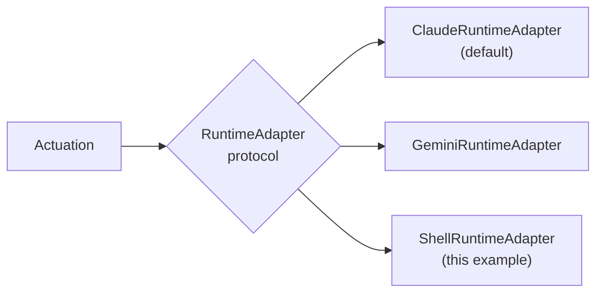

# 04 — Runtime Selection

## Purpose

Proves that runtime adapters are truly interchangeable: the identical reference Goal, run through the
identical pipeline, completes via the Shell runtime adapter instead of the default Claude adapter —
with a one-line change, and with Orchestration, Harness, Validation, and Recovery completely
unaffected.

## Prerequisites

See [examples/README.md](../README.md#prerequisites-all-examples). Builds on
[01 — Hello Nexus](../01-hello-nexus/).

## Architecture



Every adapter implements the same `nexus_execution.adapter.RuntimeAdapter` protocol — advertise
capabilities, configure, execute, normalize events. Nothing above this layer branches on which one is
in use.

## Code Walkthrough

```python
def _shell_adapter_factory(request: SpineRequest) -> ShellRuntimeAdapter:
    return ShellRuntimeAdapter(invoker=StubShellInvoker(fail=request.fail))

pipeline = build_constitutional_pipeline(infra, adapter_factory=_shell_adapter_factory)
```

`adapter_factory` is a real, existing parameter of `build_constitutional_pipeline` — production code
uses the same seam with its own default factory (`ClaudeRuntimeAdapter` + `StubClaudeInvoker`, see
`nexus_workflows/spine/composition.py`). This example simply supplies a different one.

The reference Goal's work items require the `code_generation` capability. This works with the Shell
adapter specifically because `ShellRuntimeAdapter` advertises `("command_execution",
"code_generation", "file_write")` (`nexus_runtime_shell.adapter.SHELL_CAPABILITIES`) — the same
capability the Claude adapter advertises. Runtime *matching* (by capability) is exactly why this swap
works without changing the request at all.

## Expected Output

```
Runtime adapter used: shell (nexus_runtime_shell.ShellRuntimeAdapter)
status:          completed
succeeded:       True
execution outcomes: ('completed', 'completed')

Swap `_shell_adapter_factory` back to nothing (the default) and this example
becomes identical to 01-hello-nexus, which runs the same Goal against Claude.
Nothing above the adapter layer - Orchestration, Harness, the Runtime Manager's
matching/allocation logic, Validation, Recovery - changed at all.
```

## Troubleshooting

- **`DuplicateEventError` or a matching failure if you change the work items**: if you write your own
  `SpineRequest` instead of `spine_reference_request`, make sure whatever capability you require is
  actually in the adapter's advertised list, or the Runtime Manager has nothing to match against and
  allocation fails.

## Next Example

[05 — Memory](../05-memory/) — reading back the durable Knowledge Item this run (or any run) produced.
