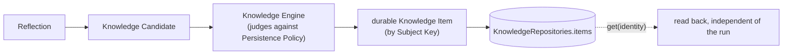

# 05 — Memory (Knowledge)

## Purpose

Shows the durable memory loop closing: a completed run's Reflection stage proposes a Knowledge
Candidate, the Knowledge Engine judges it and creates a durable Item, and this example reads that
exact Item back out by identity afterward — proving it's really persisted, not just returned as part
of the run result.

## Prerequisites

See [examples/README.md](../README.md#prerequisites-all-examples). Builds on
[02 — First Pipeline](../02-first-pipeline/).

## Architecture



## Code Walkthrough

```python
knowledge_repositories = build_knowledge_repositories()
pipeline = build_constitutional_pipeline(infra, knowledge_repositories=knowledge_repositories)
...
item = knowledge_repositories.items.get(item_id)
```

`knowledge_repositories` is a real, optional parameter of `build_constitutional_pipeline` — supplying
your own instead of letting the pipeline build a default one is exactly how you keep a durable handle
to query afterward. `items.get(identifier)` is the generic `Repository[T].get()` method
(`nexus_core/persistence/interfaces.py`) every repository in the platform implements — not a bespoke
query API for this example.

The `Knowledge` domain object's real fields are `type`, `understanding`, `confidence`, `freshness`,
and `evidence_refs` (`nexus_core/domain/knowledge.py`) — evidence-backed by contract, never
free-floating text.

## Expected Output

```
knowledge item ids recorded this run: ('ki-lesson-architecture-generation-summary',)

-- ki-lesson-architecture-generation-summary --
  type:          lesson
  understanding: promote the reusable successful approach on claude-code
  confidence:    observed
  freshness:     current
  evidence refs: 2

Run this script twice in a row against the SAME in-memory repositories object and
you would see the second run's candidate merged into this Item's version chain,
not a duplicate Item - Knowledge evolves by Subject Key, it never accumulates copies.
```

## Troubleshooting

- **`AttributeError: 'Knowledge' object has no attribute 'subject_key'` (or similar)**: the domain
  object's real fields are listed above — check `nexus_core/domain/knowledge.py` directly rather than
  guessing a field name.
- **`item is None`**: the id came from `run.knowledge_item_ids`, so this should never happen against
  the same `knowledge_repositories` instance — if it does, confirm you're not accidentally passing a
  second, different `KnowledgeRepositories` instance to `.get()`.

## Next Example

[06 — Scheduler](../06-scheduler/) — the same durability guarantee applied to *when* work happens,
not just what it remembers.
