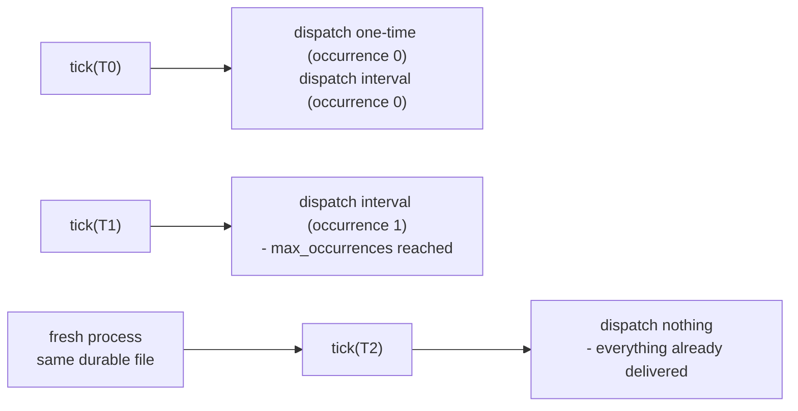

# 06 — Scheduler

## Purpose

Demonstrates one-time and recurring dispatch, then a genuine restart: a fresh process rebuilding
everything from the same durable SQLite file, proving it dispatches nothing twice and reconstructs
schedule state from the log, not from memory.

## Prerequisites

See [examples/README.md](../README.md#prerequisites-all-examples). Builds on
[02 — First Pipeline](../02-first-pipeline/).

## Architecture



## Code Walkthrough

```python
scheduler.schedule_goal(
    identity="onboarding-goal",
    request=spine_reference_request(run="one-time"),
    trigger=ScheduleTrigger.one_time(run_at=T0),
    autonomy=AutonomyMode.FULLY_AUTOMATIC,
)
scheduler.schedule_goal(
    identity="daily-report",
    request=spine_reference_request(run="recurring"),
    trigger=ScheduleTrigger.interval(interval_seconds=3600, max_occurrences=2),
    autonomy=AutonomyMode.FULLY_AUTOMATIC,
)
```

`ScheduleTrigger.one_time` / `.interval` / `.delayed` / `.from_cron` (`nexus_scheduler/model.py`) are
the real trigger constructors. Nothing fires on a wall clock inside the platform — `tick(now)` is the
only thing that makes time pass, and `now` is always an explicit, injected value.

```python
outcomes_t1 = scheduler.tick(T1)   # same scheduler object - still "process 1"
...
restarted = _boot(db_path, now=T2)  # a genuinely fresh set of objects - "process 2"
outcomes_t2 = restarted.tick(T2)
```

The first two ticks reuse the same in-memory `scheduler` object (an ordinary process, time simply
advancing). The third tick rebuilds *everything* — infrastructure, pipeline, approval exchange,
operations, scheduler — from the same durable file, simulating a real restart. Per-occurrence request
identity is derived by the Scheduler itself (`f"{schedule.identity}-{index}"`,
`nexus_scheduler/scheduler.py`), not by this example — that's what keeps two occurrences of one
recurring schedule from colliding.

## Expected Output

```
tick @ 2026-01-01T00:00:00+00:00: dispatched 2 occurrence(s)
  - onboarding-goal occurrence #0: executed=True
  - daily-report occurrence #0: executed=True
tick @ 2026-01-01T01:00:00+00:00: dispatched 1 occurrence(s)
  - daily-report occurrence #1: executed=True
tick @ 2026-01-01T02:00:00+00:00 (after restart): dispatched 0 occurrence(s)
  (the one-time schedule already fired once; the recurring schedule already
   reached max_occurrences=2 - a restarted process correctly dispatches nothing
   new here, reconstructed entirely from the durable log, not from memory)
```

## Troubleshooting

- **`PermissionError` deleting the temp directory (Windows only)**: SQLite keeps its file handle open
  until the connection object is garbage-collected, which can race Python's temp-directory cleanup.
  The script already uses `tempfile.TemporaryDirectory(ignore_cleanup_errors=True)` for this reason.
- **`DuplicateEventError` if you rebuild the platform on every tick instead of just for the restart
  step**: this was a real mistake caught while writing this example — rebuilding the whole platform
  between every tick (not just at the genuine restart) can produce spurious event collisions. Only
  rebuild when you're actually simulating a restart.

## Next Example

[07 — Approval Exchange](../07-approval-exchange/) — the other thing that pauses and resumes a
session: a human, not a clock.
