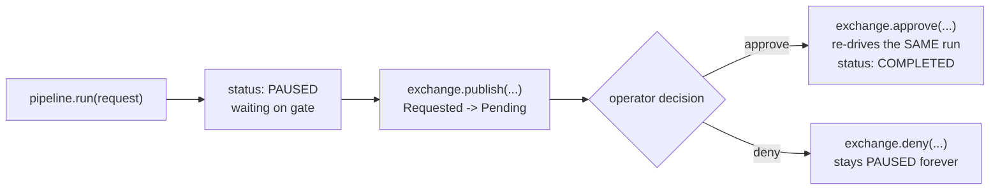

# 07 — Approval Exchange

## Purpose

Shows a gated node pausing execution, and an operator's decision resuming it — the full lifecycle:
Requested → Pending → Approved → Execution. Demonstrates that the gated node genuinely never runs
until this exact approval is recorded, not merely delayed.

## Prerequisites

See [examples/README.md](../README.md#prerequisites-all-examples). Builds on
[02 — First Pipeline](../02-first-pipeline/).

## Architecture



## Code Walkthrough

```python
request = spine_reference_request(run="approval", gated=("review",))
paused = pipeline.coordinator.run(request)
# paused.status is SpineStatus.PAUSED, not COMPLETED
```

`gated=("review",)` marks the "review" work item as an approval gate — a real, existing parameter of
`spine_reference_request`. Actuation runs everything up to that gate and stops.

```python
pending = exchange.publish(request.pipeline_session_id, paused.execution_state.waiting_nodes)
decision = exchange.approve(request, "node-review", decided_by="alice", reason="looks correct")
```

`publish` is idempotent — republishing an already-published gate is a no-op — and derives the pending
queue straight from the durable log. `approve` records the decision as immutable audit *and* re-drives
the exact same pipeline run with the newly granted gate — one call does both, per
`nexus_approval/exchange.py`.

## Expected Output

```
1. First run status: paused
   waiting on gate(s): ('node-review',)
2. Published 1 approval request(s):
   node=node-review state=pending
3. Explanation before a decision: state=pending
4. Decision recorded: state=approved, resumed=True
   pipeline status after resuming: completed

The gated node never ran until this exact approval was recorded - had `deny()`
been called instead, the session would stay paused forever and the gated node
would never execute, by design.
```

## Troubleshooting

- **`waiting_nodes` is empty**: confirm the `gated=` tuple names a real work-item key from the
  request (`spine_reference_request`'s keys are `"draft"` and `"review"`) — the gate name in
  `waiting_nodes`/approval calls is prefixed (`node-review`), the work-item key itself is not
  (`review`).
- **Want to see a denial instead?** Call `exchange.deny(request.pipeline_session_id, "node-review",
  decided_by="bob", reason="not ready")` instead of `.approve(...)` — the session stays paused and
  `decision.resumed` is `False`.

## Next Example

[08 — Replay](../08-replay/) — proving the same durability guarantee holds even after every
in-memory object from this run is thrown away.
