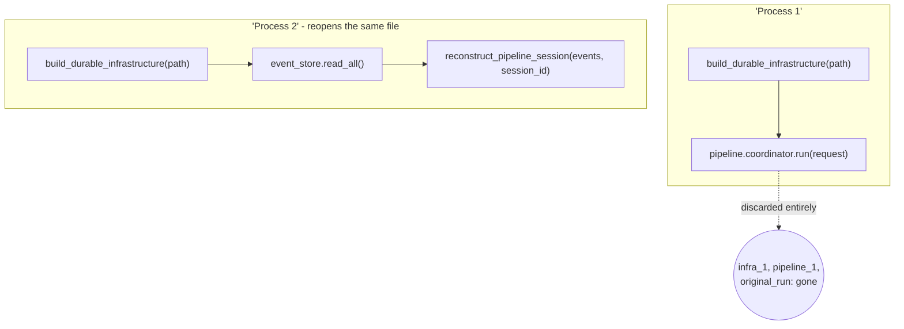

# 08 — Replay

## Purpose

Proves that state reconstruction is exact, not best-effort: this example runs a Goal to completion,
deletes every in-memory object the first run produced, reopens the same durable SQLite file from
nothing, and reconstructs an identical `PipelineSession` by reading the event log alone.

## Prerequisites

See [examples/README.md](../README.md#prerequisites-all-examples). Builds on
[06 — Scheduler](../06-scheduler/) (the same "reopen the same durable file" pattern, applied here to
one pipeline run instead of a set of schedules).

## Architecture



## Code Walkthrough

```python
infra_1 = build_durable_infrastructure(db_path)
pipeline_1 = build_constitutional_pipeline(infra_1)
original_run = pipeline_1.coordinator.run(request)
del infra_1, pipeline_1, original_run     # nothing above is used again
```

```python
infra_2 = build_durable_infrastructure(db_path)          # same file, brand-new objects
events = infra_2.event_store.read_all()
session = reconstruct_pipeline_session(events, request.pipeline_session_id)
```

`reconstruct_pipeline_session` (`nexus_workflows/spine/coordinator.py`) is a pure function: it takes
a tuple of events and a session id, and folds the `pipeline.*` stream into a `PipelineSession` —
nothing about it depends on anything from the first "process." This is the same mechanism restart
uses; replay-for-audit and restart-after-a-crash are one mechanism, not two.

## Expected Output

```
Original run status:   completed
Original stages:       ('intent', 'engineering', 'context', 'planning', 'actuation', 'validation', 'recovery', 'reflection', 'knowledge')

Reconstructed status:  completed
Reconstructed stages:  ('intent', 'engineering', 'context', 'planning', 'actuation', 'validation', 'recovery', 'reflection', 'knowledge')
Reconstructed from:    120 durable events, zero in-memory state

Every stage the original run completed is still there - reconstructed, not
remembered. This is what makes restart-after-a-crash and replay-for-audit the
same mechanism, not two different features.
```

(The exact event count, `120`, follows deterministically from the reference Goal's two work items;
it will be identical on every run against `v2.0.0`.)

## Troubleshooting

- **`PermissionError` deleting the temp directory (Windows only)**: same SQLite-handle issue as
  example 06 — already handled via `tempfile.TemporaryDirectory(ignore_cleanup_errors=True)`.
- **Reconstructed stages don't match**: confirm you're reading from the *same* `db_path` — a typo'd
  path silently opens (or creates) a different, empty database.

## Next Example

[09 — Recovery](../09-recovery/) — what happens when the thing being replayed is a failure, not a
success.
