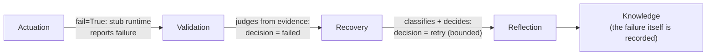

# 09 — Recovery

## Purpose

Shows that a failed execution is not a crash or a silently dropped run — it's itself a governed,
recorded outcome. The pipeline still reaches Knowledge; Validation judges the failure from evidence
(never trusting the runtime's own report); Recovery classifies it and decides a bounded continuation.
This is the clearest single example of why Nexus differs from a simple agent framework.

## Prerequisites

See [examples/README.md](../README.md#prerequisites-all-examples). Builds on
[02 — First Pipeline](../02-first-pipeline/); contrast directly with
[01 — Hello Nexus](../01-hello-nexus/) (identical call, only `fail=True` differs).

## Architecture



## Code Walkthrough

```python
request = spine_reference_request(run="recovery", fail=True)
run = pipeline.coordinator.run(request)
```

`fail=True` is a real, existing field on `SpineRequest`, honored by the default composition root's
`_default_adapter_factory` (`nexus_workflows/spine/composition.py`): `ClaudeRuntimeAdapter(invoker=
StubClaudeInvoker(fail=request.fail))`. This is the same seam RC1's and RC2's own regression tests
use to prove recovery/restart behavior under failure — not a bespoke failure injection built for this
example.

```python
assert run.status.value == "completed"   # still reaches Knowledge
assert not run.succeeded                 # but did not succeed
assert run.knowledge_item_ids            # even a failed run records what was learned
```

## Expected Output

```
pipeline status:      completed   (still reaches Knowledge)
run.succeeded:        False   (but this run did not succeed)
execution outcomes:   ('failed', 'failed')
validation decisions: ('failed', 'failed')   (evidence-judged, not self-reported)
recovery decisions:   ('retry', 'retry')   (a deterministic, bounded continuation)
knowledge recorded:   True   (('ki-lesson-architecture-generation-summary', 'ki-lesson-architecture-generation-summary', 'ki-lesson-architecture-generation-summary'))

Compare this to 01-hello-nexus: same pipeline, same call, only `fail=True` differs.
Nothing crashed, nothing was silently dropped, and the platform still knows exactly
what happened and what it decided to do about it.
```

## Troubleshooting

- **Expecting `run.status` to be a failure state**: there isn't one — `SpineStatus` is only
  `RUNNING` / `COMPLETED` / `PAUSED` (`nexus_workflows/spine/model.py`). "Did this run succeed" is
  answered by `run.succeeded` and `run.execution_outcomes`/`validation_decisions`, not by `status`.
  Conflating "the pipeline finished" with "the work succeeded" is the exact distinction this example
  exists to make concrete.

## Next Example

[10 — Autonomous Workflow](../10-autonomous-workflow/) — the showcase: everything from examples 01–09
composed into one end-to-end, no-human-in-the-loop run.
