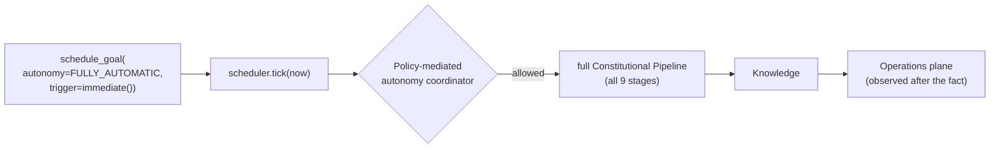

# 10 — Autonomous Workflow (Showcase)

## Purpose

The showcase example: a Goal registered against the Scheduler with `AutonomyMode.FULLY_AUTOMATIC`,
fired by a single tick with no operator involved, dispatched through the full Constitutional Pipeline,
and observed afterward through the Operations plane — all over one durable log, all in one process.
This is what every previous example was building toward.

## Prerequisites

See [examples/README.md](../README.md#prerequisites-all-examples). Builds on
[03 — Policy Governance](../03-policy-governance/), [06 — Scheduler](../06-scheduler/),
[07 — Approval Exchange](../07-approval-exchange/), and [09 — Recovery](../09-recovery/) — this
example doesn't re-explain any of those mechanisms, only composes them.

## Architecture



## Code Walkthrough

```python
scheduler.schedule_goal(
    identity="daily-summary",
    request=spine_reference_request(run="autonomous"),
    trigger=ScheduleTrigger.immediate(),
    autonomy=AutonomyMode.FULLY_AUTOMATIC,
)
outcomes = scheduler.tick(NOW)
```

`FULLY_AUTOMATIC` does not skip governance — it skips *waiting for a human*. The
`AutonomousExecutionCoordinator` (`nexus_scheduler/autonomy.py`) still asks the Policy Engine whether
the dispatch is allowed (`outcome.policy_allowed`, `outcome.policy_decision`) before the pipeline ever
runs. Compare this to example 07: there, a gate required an explicit human decision; here, the same
governed pipeline runs without one, because the schedule itself was registered at the fully-automatic
tier.

```python
summary = operations.service.session_lookup(f"pipe-{session_id}")
```

Exactly the same Operations-plane pattern as example 02, applied to a scheduler-dispatched session
instead of a directly-run one — proof that the pipeline itself doesn't know or care whether it was
invoked directly or through the Scheduler.

## Expected Output

```
Registering a Fully-Automatic goal, due immediately...
Ticking the scheduler once - this is the only thing that makes time pass...

schedule:        daily-summary
autonomy:        fully_automatic
executed:        True   (no operator was asked)
policy allowed:  True (allow)

-- Operations plane, after the fact --
session:           pipe-daily-summary-0
status:            completed
stages completed:  ('intent', 'engineering', 'context', 'planning', 'actuation', 'validation', 'recovery', 'reflection', 'knowledge')
```

## Troubleshooting

- **`executed: False`**: check `policy_allowed` — if Policy denies the dispatch (e.g. under a custom
  policy set stricter than the platform defaults this example seeds implicitly through
  `build_human_interaction`), the schedule stays due but doesn't run, exactly as governance intends.
- **Session not found in Operations**: the per-occurrence session id is
  `pipe-{schedule_identity}-{occurrence_index}` — the `-0` suffix is the Scheduler's own occurrence
  numbering (see example 06's walkthrough), easy to forget when constructing the lookup id by hand.

## What's next

This is the last example in the library. From here: the [architecture portal](../../docs/architecture/README.md)
for the full design behind everything demonstrated above, or
[docs/internals/WALKTHROUGH-v2.md](../../docs/internals/WALKTHROUGH-v2.md) to read the actual
composition-root code these examples call.
